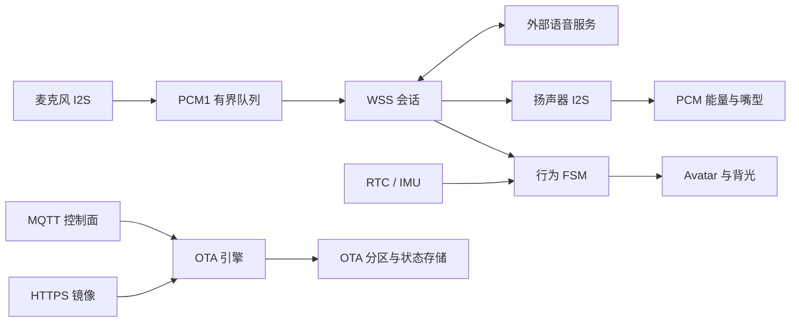

# Julia Fused-Base

Julia Fused-Base 是面向 ESP32-S3 陪伴终端的设备固件，提供麦克风采集、WSS 语音传输、扬声器播放、屏幕表情、行为状态机、RTC／IMU 情境输入和 MQTT／HTTPS 固件 OTA。

文档版本：V1.0。适用对象：当前工作区的实际构建配置。固件版本由根目录 `CMakeLists.txt` 的 `PROJECT_VER` 定义，当前为 `0.1.0`；文档版本与固件版本独立。

## 能力范围

| 能力 | 当前实现 |
| --- | --- |
| 语音采集与上传 | 单声道 PCM16、16kHz，常规帧为 20ms；通过 WSS 发送 PCM1 消息 |
| 语音唤醒 | 默认由服务器检测，WSS 会话建立后持续上传；本地 WakeNet 是另一种编译配置 |
| 播放与打断 | WSS 文本命令控制原始 PCM 播放；`MIC_START` 可停止当前扬声器播放并进入听音 |
| 显示 | 360×360 ST77916 QSPI 屏、LVGL、静态立绘、眨眼、PCM 能量驱动嘴型、背光呼吸 |
| 行为与情境 | 六个主状态、二十个子状态；RTC／SNTP 校时、夜间策略、IMU 运动唤醒 |
| 固件 OTA | 请求关联、清单和镜像校验、双应用分区、启动确认／回滚、状态持久化与上报 |
| SD 文件外发 | SDMMC 1-bit 挂载 `/sdcard`，通过 `FILE_SEND` 外发 WAV 文件 |
| 音频素材下载 | 有独立服务与引擎源码并参与编译；检查请求、MQTT 响应分发和播放闭环尚未接通 |
| 记忆与情感 | 有参考源码与状态定义；用户记忆、例行学习和情感识别不属于已接通能力 |

“有实现”表示存在代码路径，不代表已完成硬件验收。尤其是 OTA Range 续传：当前 ESP-IDF 5.5.4 配置未提供代码所依赖的响应头保存开关，206 恢复路径会失败，不能把断点记录等同于完整续传能力。

本仓库不包含服务器、App／小程序或产线系统。ASR、LLM、TTS 和服务器唤醒算法由外部服务承担，固件不限定其供应商。

## 硬件与软件基线

| 项目 | 配置 |
| --- | --- |
| 芯片／目标 | ESP32-S3，`esp32s3` |
| 板级布局 | Waveshare ESP32-S3-LCD-1.85 的屏幕、音频、RTC、IMU 与 SD 接线 |
| SDK | ESP-IDF 5.5.4 |
| 显示库 | 仓库内 LVGL 8.3.11 |
| Flash | 16MiB，两个 7MiB OTA 应用分区 |
| PSRAM | 板级配置为 8MiB Octal／OPI，80MHz；实机容量以启动日志确认 |
| CPU | 当前配置 240MHz |
| 应用镜像名 | `julia_fused_base` |
| OTA 产品／硬件标识 | `julia-ai-device`／`1.0` |

实际编译范围以 [main/CMakeLists.txt](main/CMakeLists.txt) 为准。源文件存在、位于包含路径内或组件参与链接，都不表示对应业务已经由应用入口启动。

## 快速开始

1. 准备 ESP-IDF 5.5.4 环境及与当前板卡匹配的工具链。
2. 检查根目录 CMake 中的本机工具路径，以及 Wi-Fi、MQTT、WSS 和服务器根证书配置。
3. 在已激活的 ESP-IDF 终端构建：

```powershell
idf.py -B build build
```

4. 核对镜像元信息、板卡和串口后，再按 [构建与发布](docs/BUILD_AND_RELEASE.md) 执行烧录及监视。
5. 服务器按照 [通信协议](docs/PROTOCOL.md) 完成 WSS 会话、语音命令和 MQTT OTA 对接。

完整 Windows 工具路径示例、配置优先级、镜像检查及发布约束见构建文档。`sdkconfig.defaults.esp32h2` 不是本板卡可直接使用的适配方案。

## 运行流程



默认模式下，待机、听音、思考和说话期间均可持续上传麦克风。`MIC_STOP` 表示当前用户话语结束，不是隐私静音；屏幕闭眼或背光呼吸也不表示麦克风停止或芯片进入低功耗睡眠。

## 文档导航

| 文档 | 用途 |
| --- | --- |
| [源码组织](main/README.md) | 模块职责、启动顺序、任务所有权及未接入源码 |
| [通信协议](docs/PROTOCOL.md) | WSS 帧、命令语义、MQTT 主题、OTA 清单与状态 |
| [显示与交互](docs/UI_L0L1_PORT.md) | 实际显示链路、状态映射、嘴型和待机策略 |
| [构建与发布](docs/BUILD_AND_RELEASE.md) | 环境、配置、镜像标识、烧录和发布门槛 |
| [验证与验收](docs/VALIDATION.md) | 功能、故障、性能和发布验证清单 |
| [工程边界与已知限制](docs/COMMENT_AUDIT_FINDINGS.md) | 当前限制、影响和待验证事项 |

## 使用边界

当前配置面向受控开发环境：MQTT 使用明文连接且未启用设备认证；WSS 使用根证书，但跳过服务器名称校验；生产凭据、安全启动、Flash 加密和电源验收仍需产品化配置与验证。不要把开发凭据用于生产，也不要把包含凭据的配置或固件公开分发。

服务器唤醒模式下，连续在线一天的裸 PCM 数据约为 2.76GB／台，不含 PCM1、WebSocket、TLS 和网络开销。部署前应明确采音授权、数据保留策略、带宽和功耗预算。
