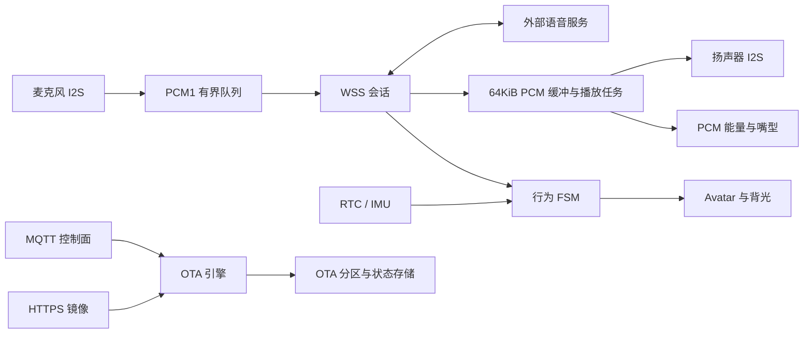

# Julia Fused-Base

Julia Fused-Base 是面向 ESP32-S3 陪伴终端的设备固件，提供麦克风采集、WSS 语音传输、扬声器播放、屏幕表情、行为状态机、RTC／IMU 情境输入和 MQTT／HTTPS 固件 OTA。

文档版本：V1.0。实现核对日期：2026-08-31。适用对象：当前工作区的实际构建配置。固件版本由根目录 `CMakeLists.txt` 的 `PROJECT_VER` 定义，当前为 `0.1.0`；文档版本与固件版本独立。

## 能力范围

| 能力 | 当前实现 |
| --- | --- |
| 开机编排 | 显示基础设施就绪后，动画任务与音频、RTC、SD、Wi-Fi 初始化并行；汇合后放行交互 |
| 语音采集与上传 | 单声道 PCM16、16kHz，常规帧为 20ms；通过 WSS 发送 PCM1 消息 |
| 语音唤醒 | 默认由服务器检测，WSS 会话建立后持续上传；本地 WakeNet 是另一种编译配置 |
| 播放与打断 | WSS 向 64KiB PSRAM 缓冲投递 PCM；独立播放任务驱动 I2S，正常结束排空尾音，`MIC_START` 取消待播数据 |
| 显示 | 360×360 ST77916 QSPI 屏、LVGL、静态立绘、眨眼、PCM 能量驱动嘴型、背光呼吸 |
| 行为与情境 | 六个主状态、二十个子状态；RTC／SNTP 校时、夜间策略、IMU 运动唤醒 |
| 固件 OTA | 请求关联、清单和镜像校验、双应用分区、启动确认／回滚、状态持久化与上报 |
| SD 文件外发 | SDMMC 1-bit 挂载 `/sdcard`，通过 `FILE_SEND` 外发 WAV 文件 |
| 音频素材下载 | 有独立服务与引擎源码并参与编译；检查请求、MQTT 响应分发和播放闭环尚未接通 |
| 记忆与情感 | 有参考源码与状态定义；用户记忆、例行学习和情感识别不属于已接通能力 |

“有实现”表示存在代码路径，不代表已完成硬件验收。尤其是 OTA Range 续传：当前 ESP-IDF 5.5.4 配置未提供代码所依赖的响应头保存开关，206 恢复路径会失败，不能把断点记录等同于完整续传能力。

本仓库不包含服务器、App／小程序或产线系统。ASR、LLM、TTS 和服务器唤醒算法由外部服务承担，固件不限定其供应商。

## 硬件与软件基线

| 项目 | 配置 |
| --- | --- |
| 芯片／目标 | ESP32-S3，`esp32s3` |
| 板级布局 | Waveshare ESP32-S3-LCD-1.85 的屏幕、音频、RTC、IMU 与 SD 接线 |
| SDK | ESP-IDF 5.5.4 |
| 显示库 | 仓库内 LVGL 8.3.11 |
| Flash | 16MiB，两个 7MiB OTA 应用分区 |
| PSRAM | 板级配置为 8MiB Octal／OPI，80MHz；实机容量以启动日志确认 |
| CPU | 当前配置 240MHz |
| 应用镜像名 | `julia_fused_base` |
| OTA 产品／硬件标识 | `julia-ai-device`／`1.0` |

实际编译范围以 [main/CMakeLists.txt](main/CMakeLists.txt) 为准。源文件存在、位于包含路径内或组件参与链接，都不表示对应业务已经由应用入口启动。

## 目录结构

```text
julia-fused-base/
├─ main/                        应用源码，按功能域组织
│  ├─ app/                      应用入口、并行开机、闲置显示策略
│  ├─ voice/                    WSS 语音业务、播放任务、PCM 缓冲、唤醒
│  ├─ network/                  Wi-Fi 生命周期、MQTT、HTTP 下载
│  ├─ ota/                      固件清单、下载、校验、启动确认与上报
│  ├─ fsm/                      行为状态转换与运行实例
│  ├─ context/                  时间同步、夜间策略、运动检测
│  ├─ display/                  LCD 面板驱动和板级配置
│  ├─ lvgl_port/                LVGL 任务、绘制缓冲与刷新同步
│  ├─ ui/                       立绘、眼睛／嘴型、背光与生成资源
│  ├─ hardware/                 IO 扩展器、RTC、IMU 与 LED 接口
│  ├─ storage/                  SDMMC 挂载与存储接口
│  ├─ audio/                    音频素材下载模块，业务入口未接通
│  ├─ memory/                   记忆／例行参考源码，未参与当前构建
│  ├─ PCF85063/、QMI8658/        参考驱动，当前使用 hardware/ 下的共享接口
│  ├─ CMakeLists.txt            实际源文件、依赖与资源注册
│  └─ Kconfig.projbuild         应用配置项
├─ components/
│  ├─ julia_board_audio/        MIC／扬声器 I2S 驱动
│  ├─ lvgl__lvgl/               LVGL 显示库
│  ├─ espressif__esp-sr/        本地语音识别依赖，按配置启用
│  └─ espressif__esp-dsp/       DSP 运算依赖
├─ tests/host/                  PCM 缓冲与播放控制主机回归测试
├─ docs/                        协议、显示、构建、验收及已知限制
├─ scripts/                     开发辅助脚本
├─ server_certs/                固件使用的证书材料
├─ .vscode/                     本机编辑器设置，不纳入 Git
├─ CMakeLists.txt               工程名、版本和顶层构建入口
├─ sdkconfig                    当前固件配置
├─ sdkconfig.defaults           项目默认配置
├─ dependencies.lock            依赖版本记录
└─ partitions_16mb.csv          Flash 分区布局
```

`build/`、`build-host/` 和 `build-ota-name/` 是生成目录，不属于源码。`voice/` 负责实时对话音频，`audio/` 负责音频素材下载，二者职责不同。模块详情及未参与编译的文件见 [源码组织](main/README.md)。

## 快速开始

1. 准备 ESP-IDF 5.5.4 环境及与当前板卡匹配的工具链。
2. 检查根目录 CMake 中的本机工具路径，以及 Wi-Fi、MQTT、WSS 和服务器根证书配置。
3. 在已激活的 ESP-IDF 终端构建：

```powershell
idf.py -B build build
```

4. 核对镜像元信息、板卡和串口后，再按 [构建与发布](docs/BUILD_AND_RELEASE.md) 执行烧录及监视。
5. 服务器按照 [通信协议](docs/PROTOCOL.md) 完成 WSS 会话、语音命令和 MQTT OTA 对接。

完整 Windows 工具路径示例、配置优先级、镜像检查及发布约束见构建文档。`sdkconfig.defaults.esp32h2` 不是本板卡可直接使用的适配方案。

VS Code 的 ESP-IDF 构建路径与 IntelliSense 均使用 `build/`。只需生成编译数据库及 `sdkconfig.h` 时可运行 `idf.py -B build reconfigure`；这不生成完整固件。编辑器报错排查见 [构建与发布](docs/BUILD_AND_RELEASE.md)。

## 运行流程



默认模式下，待机、听音、思考和说话期间均可持续上传麦克风。`MIC_STOP` 表示当前用户话语结束，不是隐私静音；屏幕闭眼或背光呼吸也不表示麦克风停止或芯片进入低功耗睡眠。

## 文档导航

| 文档 | 用途 |
| --- | --- |
| [源码组织](main/README.md) | 模块职责、启动顺序、任务所有权及未接入源码 |
| [通信协议](docs/PROTOCOL.md) | WSS 帧、命令语义、MQTT 主题、OTA 清单与状态 |
| [显示与交互](docs/UI_L0L1_PORT.md) | 实际显示链路、状态映射、嘴型和待机策略 |
| [构建与发布](docs/BUILD_AND_RELEASE.md) | 环境、配置、镜像标识、烧录和发布门槛 |
| [验证与验收](docs/VALIDATION.md) | 功能、故障、性能和发布验证清单 |
| [工程边界与已知限制](docs/COMMENT_AUDIT_FINDINGS.md) | 当前限制、影响和待验证事项 |
| [主机回归测试](tests/host/README.md) | 测试构建、覆盖范围及模拟硬件的边界 |

## 使用边界

当前配置面向受控开发环境：MQTT 使用明文连接且未启用设备认证；WSS 使用根证书，但跳过服务器名称校验；生产凭据、安全启动、Flash 加密和电源验收仍需产品化配置与验证。不要把开发凭据用于生产，也不要把包含凭据的配置或固件公开分发。

服务器唤醒模式下，连续在线一天的裸 PCM 数据约为 2.76GB／台，不含 PCM1、WebSocket、TLS 和网络开销。部署前应明确采音授权、数据保留策略、带宽和功耗预算。
