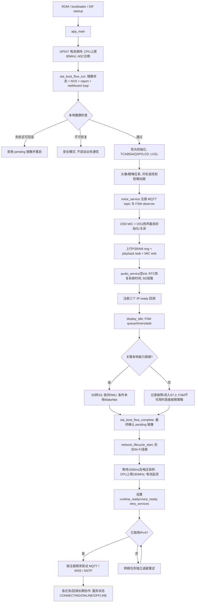
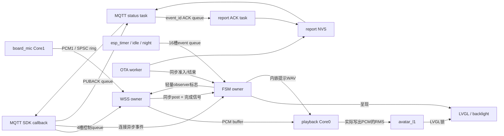
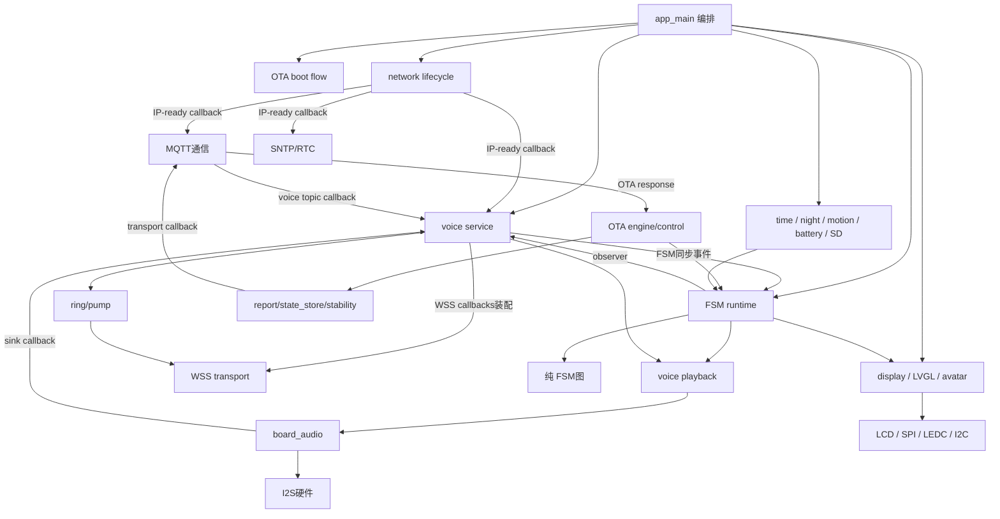
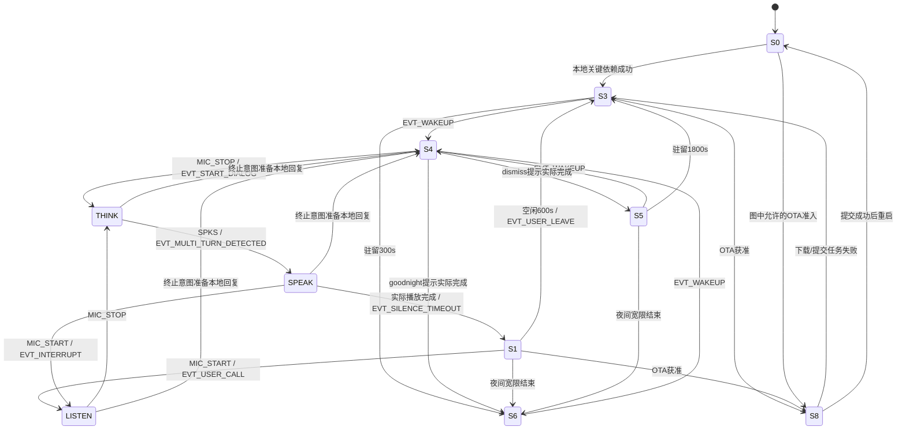
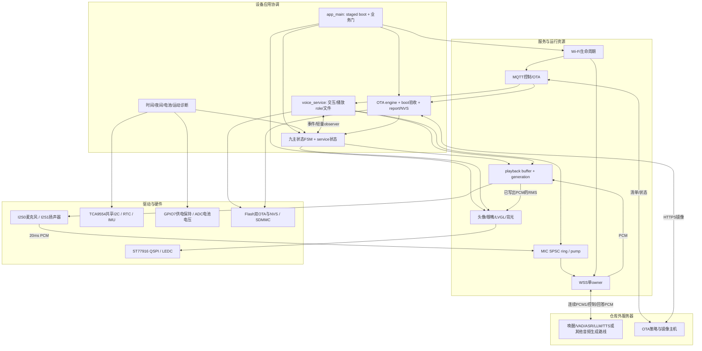

# Julia Fused-Base 项目级静态审查报告

> 归档说明：本报告保留初次审查结论。迁入项目时发现部分源码/文档已变化，尤其main/ui/julia_avatar.c/.h；未对这些后续变化重审。源码行号对应原审查快照，当前文件可能已偏移。变化清单和迁移范围见同目录README及migration_verification.json。

审查日期：2026-09-07。仓库：`D:/Espressif/projects/julia-fused-base`。HEAD：`826ca6e7cf0446f40fcfe7a826c433ad89b6442d`，**以当前含未提交修改的工作区为审查对象，不等同于该提交的纯净版本**。

初次审查未修改固件源码、配置、依赖或仓库文档，未提交、烧录；报告和验证产物当时写入仓库外。随后按用户要求，将审查文档及证据迁入本项目 `docs/reviews/2026-09-07/`，并补充技术对比资料。采用整仓清单→构建入口→启动顺序→任务/回调→业务链路→跨模块核对→异常路径的顺序。根及父级未发现适用的 AGENTS.md。

证据分级：**【确认】**可由当前源码、配置或本轮验证直接证明；**【高概率】**路径明确但实机触发概率未测；**【可能】**需要特定并发/故障条件；**【无法从当前静态代码确认】**依赖服务器、物理硬件或测试记录。

范围说明：全仓文件清单覆盖第一方代码、头文件、配置、工具、文档、素材与第三方组件；主运行链逐函数追踪。第三方 LVGL/ESP-SR/ESP-DSP 审查其构建选择、接口和有关运行资源，**未对全部第三方算法、汇编、预编译库逐行证明正确性**。服务端、App、原理图、产线系统不在本仓库。已有 build 清单和 ELF 只作链接旁证，本轮没有重新构建完整 ESP-IDF 固件。

配套：[源码、配置、资源与整仓索引](D:/Espressif/projects/julia-fused-base/docs/reviews/2026-09-07/审查附录_源码配置资源索引.md)；[固件改进方向完成度](D:/Espressif/projects/julia-fused-base/docs/reviews/2026-09-07/固件改进方向完成度.md)。

## 1. Executive Summary

【确认】这是运行在 ESP32-S3 上的 ESP-IDF 5.5.4 固件。当前版本 `0.1.0`，采用 LVGL 8.3.11 + ST77916 360×360 显示、独立 I2S 麦克风/扬声器、Wi-Fi + MQTT + 自实现 WSS，以及双应用分区 OTA。应用逻辑大多属于同一个 `main` component；文件夹划分是逻辑模块边界，不是独立链接组件。

【确认】上电先保持电池供电、设置启动 CPU 上限、准备 ADC 和 OTA/NVS 基础设施，然后串行初始化显示与开机动画、语音装配与 I2S、时间和 SD、空闲策略与 FSM。关键本地依赖通过后才确认待验证镜像。Wi-Fi 最后启动，完成额外等待后开放 MQTT/WSS 启动门控。默认启动到 **S3 待机**，而非 S1。

【确认】当前开启**服务端唤醒**：WSS 建立即持续发送 16kHz PCM1，服务端决定唤醒、话语开始/结束及回答下发。固件不执行当前业务的 ASR、LLM 或在线 TTS。S6 关闭面板/背光，但仍保留采音、联网与 CPU 运行；它不是芯片深睡，也不是隐私静音。

最重要的发现：

1. **启动和所有权已有明确保护。** 网络业务门控、OTA 延迟确认、WSS 单任务拥有 TLS、播放 generation、SPSC 上行 ring、FSM 截止时间补偿均已实现，不应继续报告为“完全没有初始化/并发保护”。证据：[main/app/main.c:223](D:/Espressif/projects/julia-fused-base/main/app/main.c:223)、[main/app/main.c:319](D:/Espressif/projects/julia-fused-base/main/app/main.c:319)、[main/ota/ota_boot_flow.c:283](D:/Espressif/projects/julia-fused-base/main/ota/ota_boot_flow.c:283)、[main/voice/voice_uplink_ring.c:12](D:/Espressif/projects/julia-fused-base/main/voice/voice_uplink_ring.c:12)。
2. **仍有行为层停留缺口。** S4 的空闲离开事件不被映射；S2.2 等待回答没有业务超时。连接仍健康而服务器不再发业务命令时，设备可一直停留。实际 FSM 源码探针已验证相关事件被忽略，见 R01。
3. **MQTT 恢复闭环不完整。** 主动 stop/start 的 start 失败后没有定时重试；语音 topic 非 critical，订阅失败也不重试，设备仍可能显示服务 ONLINE。见 R02/R03。
4. **OTA 退避期间仍独占 S8。** 持久化冷却在进入 S8 后阻塞下载任务，最长 3600 秒；期间正常唤醒被拒绝。普通下载失败结束时实际返回 S3，部分协议文档仍写成保留 S8。见 R04/R13。
5. **内部播放代次不等于协议轮次隔离。** 网络裸 PCM/SPKE 没有 turn_id；旧轮次迟到消息仍可能进入新轮次。已有文档将此列为暂缓联调项，见 R05。
6. **“有代码”与“已完成产品能力”差异明显。** 音频素材下载只调用空 init；旧 ASR/LLM/TTS 编排、情绪、memory/routine、旧 UI 当前未编译。GPIO LED 代码虽被 CMake 选中，也没有初始化调用。
7. **局部故障恢复仍有遗漏。** UI 应用超时不保证重试、MIC 读失败没有模块恢复、SD 只开机挂载一次、显示初始化没有完整资源回滚。见 R06–R10。
8. **当前测试不是 20/20。** 本轮独立主机构建成功，CTest **19/20 通过**；`recovery_fsm` 的生成测试代码缺少新增提示音依赖，编译失败。不能把该失败说成固件编译错误，也不能沿用旧文档的 20 项通过结论。见 R11。

【无法从当前静态代码确认】冷启动实测耗时、音质/回声、最坏多核调度延迟、各状态电流、OTA 断电恢复达标和服务器识别质量。本轮未确认可直接定级 P0 的现行缺陷；这不构成“没有 P0”的形式化保证。优先进一步验证 S4/S2 退出、MQTT 故障注入、OTA 冷却期间可交互性和真实电池供电。

## 2. 项目目录与模块地图

### 2.1 整仓结构与角色

```text
julia-fused-base/
├─ CMakeLists.txt                    工程/版本/构建工具与 OTA 镜像名一致性检查
├─ sdkconfig                        当前配置
├─ sdkconfig.defaults               新建配置的基线；不是实时覆盖层
├─ sdkconfig.defaults.esp32h2        H2 遗留片段；不代表本板支持 H2
├─ sdkconfig.old                    配置备份
├─ partitions_16mb.csv              NVS、otadata、双 OTA、model、audio_data
├─ dependencies.lock                IDF/组件管理器锁定信息
├─ server_certs/                    当前根证书及备份证书
├─ *.wav                            四段内嵌本地提示音
├─ main/                            一个 main component
│  ├─ app/                          app_main、空闲活动策略
│  ├─ fsm/                          纯状态图、RTOS 适配、故障持久化
│  ├─ network/                      Wi-Fi 生命周期、MQTT、HTTPS 下载/解析工具
│  ├─ voice/                        WSS、业务命令、上行 ring、下行播放、URI
│  ├─ ota/                          启动验收、清单、下载、持久化、上报
│  ├─ audio/                        音频素材下载的未接通业务模块
│  ├─ display/ + lvgl_port/          ST77916/QSPI、LVGL 刷新与硬件呈现
│  ├─ ui/                           当前头像/眼嘴/背光 + 多套旧 UI 实现
│  │  └─ generated/                 当前静态资产、嵌入 clip、旧素材/预览
│  ├─ hardware/                     电源、电池、TCA9554、共享 RTC/IMU、LED
│  ├─ storage/                      当前 SDMMC 挂载 + 旧 julia_sd
│  ├─ context/                      当前校时/夜间/运动 + 旧 julia_context
│  ├─ memory/                       未编译的用户记忆和 routine
│  ├─ PCF85063/ + QMI8658/           未编译的旧驱动
│  └─ julia_voice.c/.h              未编译的旧整套语音编排
├─ components/
│  ├─ julia_board_audio/            当前 I2S 硬件 component
│  ├─ lvgl__lvgl/                   LVGL 8.3.11
│  ├─ espressif__esp-sr/            1.9.4；当前 server wake 下为空 component
│  └─ espressif__esp-dsp/           1.4.12；仍见编译项，非本地识别运行证明
├─ tests/host/                      独立 CMake、C 用例、Python 提取测试、SDK stubs
├─ scripts/                         词法/注释检查和旧编译数据库生成工具
├─ docs/ + README + 两份协议.docx   使用、协议、修复记录、验收与已知边界
├─ .vscode/ + .clangd                编辑器/工具配置
└─ build/、build-host/、build-ota-name/  已有产物与缓存
```

全量文件名与 SHA-256 记录见附录及 `inventory.json`。脚本扫描纳入非构建文件 1642 项；当前 CMake 选择 **51 个 main C 文件 + 1 个板级音频 C 文件**，与已有 `build/compile_commands.json` 的这两部分逐文件一致。计数包含已选择但未调用的文件，并不等于 52 个活动模块。

### 2.2 编译配置 → component → 源文件

| 配置/入口 | component/依赖 | 实际作用与证据 |
| --- | --- | --- |
| 根 CMake、`PROJECT_VER=0.1.0`、`project(julia_fused_base)` | IDF project.cmake | 开启 compile_commands；设置 MINIMAL_BUILD；传递本机 Ninja/Xtensa 路径；配置 OTA_IMAGE_PROJECT_NAME 与工程名不一致时 FATAL_ERROR。[CMakeLists.txt:3](D:/Espressif/projects/julia-fused-base/CMakeLists.txt:3)、[CMakeLists.txt:11](D:/Espressif/projects/julia-fused-base/CMakeLists.txt:11)、[CMakeLists.txt:24](D:/Espressif/projects/julia-fused-base/CMakeLists.txt:24) |
| main `set(srcs)` | `main` | 显式列举源文件，不递归编译整个 main。[main/CMakeLists.txt:26](D:/Espressif/projects/julia-fused-base/main/CMakeLists.txt:26) |
| `PRIV_REQUIRES` | HTTP/http_parser、app_update、bootloader_support、Flash/eFuse/NVS、GPIO/I2C/SPI/I2S/SDMMC/ADC/LCD、Wi-Fi/netif/lwIP、JSON/TLS/MQTT、LVGL、board_audio 等 | 全部业务目录合在同一个 component，因此 CMake 无法约束 voice↔fsm↔UI 的内部层次。[main/CMakeLists.txt:96](D:/Espressif/projects/julia-fused-base/main/CMakeLists.txt:96) |
| `main/idf_component.yml` | `${IDF_PATH}/examples/common_components/protocol_examples_common` | 引入示例组件的配置/公共定义；当前启动没有调用它的同步 `example_connect()`。main/idf_component.yml:1、[main/network/network_lifecycle.c:532](D:/Espressif/projects/julia-fused-base/main/network/network_lifecycle.c:532) |
| `CONFIG_JULIA_SERVER_WAKE_ENABLE=y` | esp-sr 空注册，wake_detector.c 不选 | 开关关闭才追加 WakeNet 源及依赖；SR 的 CMake 顶部另行短路库和模型打包。[main/CMakeLists.txt:137](D:/Espressif/projects/julia-fused-base/main/CMakeLists.txt:137)、[components/espressif__esp-sr/CMakeLists.txt:1](D:/Espressif/projects/julia-fused-base/components/espressif__esp-sr/CMakeLists.txt:1) |
| `JULIA_BACKLIGHT_GPIO=5` / `JULIA_LED_GPIO=4` | main 私有编译定义 | 覆盖头/源 fallback；当前背光是 GPIO5，不能根据 fallback 推断占用扬声器 WS GPIO38。[main/CMakeLists.txt:165](D:/Espressif/projects/julia-fused-base/main/CMakeLists.txt:165) |
| LVGL component | `REQUIRES esp_timer`，公开 LV_CONF_INCLUDE_SIMPLE | 核心源递归选择；示例/演示还受配置与目录实际内容控制。components/lvgl__lvgl/env_support/cmake/esp.cmake:1 |
| board_audio component | I2S/GPIO/driver/FreeRTOS | 唯一源码 `board_audio.c`；硬件数据通路不反向调用业务模块，用 sink 回调连接。[components/julia_board_audio/CMakeLists.txt:1](D:/Espressif/projects/julia-fused-base/components/julia_board_audio/CMakeLists.txt:1) |
| EMBED_TXTFILES / EMBED_FILES | 固件只读数据 | 当前 CA；条件客户端证书/私钥；LISTEN/THINK/SPEAK clip；断网/低电量/告别/晚安 WAV。[main/CMakeLists.txt:5](D:/Espressif/projects/julia-fused-base/main/CMakeLists.txt:5) |

【确认】已有编译数据库中，LVGL 有 192 个文件、DSP 有 137 个文件，SR 没有 C 编译项。DSP 仍由依赖图带入；不能据此说设备执行本地 WakeNet。已有 ELF 中可见 `app_main`、`audio_service_init` 和 FSM runtime；未见 `audio_engine_start`、`audio_service_handle_response`、`native_audio_build_check_request`、`julia_led_init`、`wake_detector_init`、`avatar_rle_decode_rgb565` 的定义。它支持“部分已编译代码被链接裁剪”的判断，但不替代新固件构建。

### 2.3 参与状态分类

| 分类 | 内容 | 判定依据 |
| --- | --- | --- |
| A：当前编译且运行可达 | app、FSM、Wi-Fi/MQTT/WSS、PCM ring/playback、显示/头像/背光、时间/夜间/运动、电池/电源、SD、OTA | CMake + app_main + 注册回调/任务入口闭环 |
| B：编译选择但业务未接通 | `audio/` 下载链，仅 `audio_service_init()` 空操作被调用；`http_downloader_run()` 仅被该链使用 | [main/audio/audio_service.c:39](D:/Espressif/projects/julia-fused-base/main/audio/audio_service.c:39)、[main/audio/audio_service.c:59](D:/Espressif/projects/julia-fused-base/main/audio/audio_service.c:59)；MQTT 响应只去 OTA：[main/network/mqtt_comm.c:1220](D:/Espressif/projects/julia-fused-base/main/network/mqtt_comm.c:1220) |
| B：已选但当前不运行 | julia_led、breathing_led、voice_push_demo；avatar RLE 解码辅助及相位 clip 加载辅助 | 没有初始化/调用路径；demo 配置关闭；`avatar_phase_frame_ensure()` 无调用。[main/ui/julia_avatar.c:226](D:/Espressif/projects/julia-fused-base/main/ui/julia_avatar.c:226)、[main/hardware/julia_led.c:209](D:/Espressif/projects/julia-fused-base/main/hardware/julia_led.c:209) |
| C：条件回退，当前不编译 | wake_detector.c | server wake 开关；存在完整本地 AFE/WakeNet 初始化，但没有自动断网切换 |
| C：历史参考，当前不编译 | julia_voice、julia_context、memory/routine、旧 UI/micro motion/theme/lipsync、旧 RTC/IMU、st77916_qspi、julia_sd、avatar_face、部分生成 C 资产 | 附录 A 完整列出 19 个未选 main C 文件，不能仅因它们存在就算产品能力 |
| D：独立测试/实验 | tests/host 与供应商组件内 examples/test/test_apps | 未作为应用 main 入口；host stubs 只供原生测试 |
| E：工具/文档/数据 | scripts、编辑器配置、协议、WAV/PNG/bin/clip/json | 文件/素材不会自动创建任务或启用功能；需查 CMake/引用 |

【确认】当前运行未发现两个模块分别初始化同一 I2S、重复创建默认 event loop 或重复调用 `lv_init()` 的正常启动路径。TCA9554 被显示/RTC/SD/IMU 多次请求初始化，但成功后复用同一 I2C 总线。旧驱动与旧语音未参与编译，不能把它们算作当前 GPIO/I2S 冲突。

## 3. 系统启动与初始化时序



真实顺序定位：[main/app/main.c:93](D:/Espressif/projects/julia-fused-base/main/app/main.c:93)、[main/ota/ota_boot_flow.c:182](D:/Espressif/projects/julia-fused-base/main/ota/ota_boot_flow.c:182)。图中错误分支进入回滚/安全模式时不会继续走正常后继；已确认镜像的部分故障会在 FSM 队列中异步处理，可能与 app_main 后续步骤短暂重叠。

**门控细节。** 三个回调在 Wi-Fi 启动前注册。MQTT 回调要求 `s_runtime_ready`；WSS 要求 `s_runtime_ready && s_voice_ready`；SNTP 不经过这两个门。GOT_IP 早于门打开时，网络任务收到 INVALID_STATE 后退避，门打开时 `network_lifecycle_retry_services()` 唤醒它重新尝试。设置 `started_ok` 表示服务启动 API 成功，不表示 broker/TLS 已连接。实际服务在线状态由 MQTT critical SUBACK 与 WSS 会话就绪共同决定。[main/app/main.c:70](D:/Espressif/projects/julia-fused-base/main/app/main.c:70)、[main/app/main.c:198](D:/Espressif/projects/julia-fused-base/main/app/main.c:198)、[main/network/network_lifecycle.c:365](D:/Espressif/projects/julia-fused-base/main/network/network_lifecycle.c:365)。

**启动并非“全部同步完成后才有任务运行”。** report ACK、背光、LVGL、眨眼、MIC 等任务依次创建后立即可调度；它们分别阻塞在 ACK/通知/I2S 或循环等待上。MIC task 早于 sink 装配，但 WSS MIC 默认 false，所以正常启动不读取未准备好的上行 ring。FSM 的 observer 在 FSM 创建前注册；它当前只写语音握手标志，避免从 FSM 回调反向同步等待 WSS。

**开机速度。** 动画包含 600ms 渐亮和 8×(255+120)ms 眨眼；另有 5 次 250ms 阶段间隔、1500ms Wi-Fi 后等待。8 次阶段电压采样各执行 32 次 `vTaskDelay(1)`，100Hz tick 下还会加入约秒级等待。显式等待预算合计约 9 秒量级，另加驱动/刷新/SD/调度，pending 验证可再多 5 秒 GPIO 诊断。**这是源码预算估算，不是实测启动时间，也不是硬下界**。`boot_started` 在 OTA 初段之后设置，最终日志并非从真正上电起计时。[main/app/main.c:62](D:/Espressif/projects/julia-fused-base/main/app/main.c:62)、[main/app/main.c:124](D:/Espressif/projects/julia-fused-base/main/app/main.c:124)、[main/hardware/julia_battery.c:119](D:/Espressif/projects/julia-fused-base/main/hardware/julia_battery.c:119)、[main/ui/julia_avatar.c:740](D:/Espressif/projects/julia-fused-base/main/ui/julia_avatar.c:740)。

**开机语音。** 当前启动序列没有成功开机的欢迎语/就绪提示调用。四个 WAV 分别用于断网、低电量、dismiss、goodnight；不能把它们算作“开机四动作中的语音提示已完成”。

## 4. 初始化清单

| 顺序 | 模块 / 入口 | 前置条件 | 创建资源与成功状态 | 失败处理 |
| --- | --- | --- | --- | --- |
| 1 | `julia_power_hold_enable`；[main/app/main.c:95](D:/Espressif/projects/julia-fused-base/main/app/main.c:95) | IDF GPIO可用 | GPIO7高，电池供电保持 | 仅记录错误，继续；不进入 boot_dependencies 判定 |
| 2 | `julia_power_management_init`；[main/hardware/julia_power.c:56](D:/Espressif/projects/julia-fused-base/main/hardware/julia_power.c:56) | PM配置启用 | max80/min80MHz，light_sleep=false | 记录，继续 |
| 3 | `julia_battery_diagnostics_init`；[main/hardware/julia_battery.c:221](D:/Espressif/projects/julia-fused-base/main/hardware/julia_battery.c:221) | ADC1/GPIO8 | ADC oneshot、校准handle；采样/电压状态 | 配置/校准失败删除ADC；非关键 |
| 4 | `ota_boot_health_begin`；[main/ota/ota_boot_flow.c:185](D:/Espressif/projects/julia-fused-base/main/ota/ota_boot_flow.c:185) | 分区表/bootloader | 判断 pending，未在此确认新固件 | 读状态失败进入安全模式 |
| 5 | `nvs_flash_init`；[main/ota/ota_boot_flow.c:191](D:/Espressif/projects/julia-fused-base/main/ota/ota_boot_flow.c:191) | Flash | NVS可用；fault可落盘 | pending时拒绝破坏性擦除并尝试回滚；非pending且格式/页异常时擦除NVS重试；不可恢复安全模式 |
| 6 | `native_ota_report_init`；[main/ota/ota_report.c:465](D:/Espressif/projects/julia-fused-base/main/ota/ota_report.c:465) | NVS | mutex、8槽ACK队列、ACK task、持久化report缓存 | 创建失败清理；boot只警告，后续没有统一重试此init |
| 7 | netif/default loop；[main/ota/ota_boot_flow.c:218](D:/Espressif/projects/julia-fused-base/main/ota/ota_boot_flow.c:218) | IDF网络栈 | 默认事件循环及SDK任务 | ESP_ERROR_CHECK；失败走abort而非应用级恢复 |
| 8 | 本地OTA健康检查；[main/ota/ota_boot_health.c:120](D:/Espressif/projects/julia-fused-base/main/ota/ota_boot_health.c:120) | NVS/分区等 | 检查运行/目标分区、Flash/描述/heap；临时1槽队列后删除；pending可做GPIO4诊断 | pending回滚；无旧镜像安全模式；普通镜像失败也停止启动 |
| 9 | `julia_backlight_init`；[main/ui/julia_backlight.c:179](D:/Espressif/projects/julia-fused-base/main/ui/julia_backlight.c:179) | GPIO/LEDC | GPIO5、20kHz PWM、fade ISR、递归mutex、done semaphore、PSRAM breathe task | 返回错误；任务/同步对象部分清理，LEDC无完整回滚 |
| 10 | `julia_display_init`；[main/display/julia_display.c:286](D:/Espressif/projects/julia-fused-base/main/display/julia_display.c:286) | TCA9554共享I2C | TCA总线/设备，LCD reset，SPI2总线、panel IO、panel | 中途直接返回；累计资源不完整撤销，见R10 |
| 11 | `lvgl_port_init`；[main/lvgl_port/lvgl_port.c:286](D:/Espressif/projects/julia-fused-base/main/lvgl_port/lvgl_port.c:286) | LCD panel | LVGL、2×25920B内部DMA缓冲、LVGL递归锁/panel锁/完成信号量、2ms timer、LVGL task | 各步骤返回错误；未完整释放前序资源；部分LVGL分配依赖assert |
| 12 | `julia_avatar_init`；[main/ui/julia_avatar.c:603](D:/Espressif/projects/julia-fused-base/main/ui/julia_avatar.c:603) | LVGL | root/base/眼/嘴/状态offline电池label；眼task、avatar task；s_ready=true | 首刷新失败只警告；眼task失败不传播；avatar task失败返回，已建对象/眼task仍留存 |
| 13 | `julia_avatar_play_boot_sequence`；[main/ui/julia_avatar.c:740](D:/Espressif/projects/julia-fused-base/main/ui/julia_avatar.c:740) | avatar和背光 | 渐亮、8次眨眼；s_boot_sequence_played | 动画错误降级亮度并继续，不自动判视觉依赖失败 |
| 14 | `voice_service_init`；[main/voice/voice_service.c:1275](D:/Espressif/projects/julia-fused-base/main/voice/voice_service.c:1275) | 静态注册表可用 | FSM observer、MQTT非critical语音topic；本地模式才建companion timer | 返回注册/计时错误，纳入关键依赖 |
| 15 | `board_audio_init`；[components/julia_board_audio/board_audio.c:216](D:/Espressif/projects/julia-fused-base/components/julia_board_audio/board_audio.c:216) | I2S引脚 | MIC channel长期启用；扬声器初始化后关闭/删除；speaker mutex、board_mic task | goto failed清理MIC并尝试停speaker；返回给启动判定 |
| 16 | `voice_service_init_board_audio`；[main/voice/voice_service.c:1297](D:/Espressif/projects/julia-fused-base/main/voice/voice_service.c:1297) | board_audio | 167936B PSRAM上行storage、元数据/pump；65536B播放buffer、mutex、playback task；WSS sink | 分阶段返回；已成功的前序ring可留存到重启 |
| 17 | `audio_service_init`；[main/audio/audio_service.c:39](D:/Espressif/projects/julia-fused-base/main/audio/audio_service.c:39) | 无 | 空函数，无下载任务 | 永远ESP_OK |
| 18 | `julia_time_init`；[main/context/julia_time.c:145](D:/Espressif/projects/julia-fused-base/main/context/julia_time.c:145) | 共享I2C | TZ；RTC设备handle；有效RTC恢复system time | 尽力而为；时间无效仍能继续启动 |
| 19 | `sd_card_start`；[main/storage/sd_card.c:33](D:/Espressif/projects/julia-fused-base/main/storage/sd_card.c:33) | TCA/SDMMC | 1bit SD `/sdcard`，最多4文件；mounted=true | 不格式化；失败只影响文件服务；没有监控task/重挂载循环 |
| 20 | 注册IP回调；[main/app/main.c:200](D:/Espressif/projects/julia-fused-base/main/app/main.c:200) | 生命周期未start | MQTT、WSS、SNTP三个slot | 失败只记录；当前3个小于上限，不常态触发 |
| 21 | `julia_idle_display_init`；[main/app/julia_idle_display.c:130](D:/Espressif/projects/julia-fused-base/main/app/julia_idle_display.c:130) | 静态状态/RTOS | task、last_activity、busy=false、默认STANDBY | 失败成为关键依赖失败 |
| 22 | `julia_fsm_runtime_init`；[main/fsm/julia_fsm_runtime.c:637](D:/Espressif/projects/julia-fused-base/main/fsm/julia_fsm_runtime.c:637) | 上述状态可用 | 16槽队列、4个timer、FSM task；正常S0→S3；service CONNECTING | timer失败有deadline补偿；task失败清理，app记录并受控重启/锁定 |
| 23 | night/motion；[main/app/main.c:231](D:/Espressif/projects/julia-fused-base/main/app/main.c:231) | FSM与关键能力成功 | night task；IMU handle/config + motion task | 非关键，只警告，无独立init重试 |
| 24 | 条件`wake_detector_init`；[main/app/main.c:240](D:/Espressif/projects/julia-fused-base/main/app/main.c:240) | 本地模式、MIC/voice可用 | 模型/AFE/feed buffer/fetch task | 当前禁用；启用时失败纳入OTA验收与故障 |
| 25 | `ota_boot_flow_complete`；[main/app/main.c:250](D:/Espressif/projects/julia-fused-base/main/app/main.c:250) | 本地健康汇总 | pending镜像确认VALID；上报/对账 | 失败回滚或安全模式；非pending直接返回 |
| 26 | Wi-Fi生命周期；[main/app/main.c:294](D:/Espressif/projects/julia-fused-base/main/app/main.c:294) | netif/default loop已建 | Wi-Fi driver/default STA、3个事件handler、network task | 初始化失败cleanup，app按1–60s继续重试；网络运行期后台重连 |
| 27 | runtime CPU/电池task/业务门；[main/app/main.c:306](D:/Espressif/projects/julia-fused-base/main/app/main.c:306) | 本地启动/初始Wi-Fi等待 | max160MHz；10s电池监测；runtime/voice门开放 | CPU、电池task失败仅警告；WSS仍受voice_ready门限制 |
| 28 | IP-ready服务分派；[main/network/network_lifecycle.c:365](D:/Espressif/projects/julia-fused-base/main/network/network_lifecycle.c:365) | IPv4、门控 | MQTT各资源/WSS owner/SNTP | 每个slot独立退避；MQTT/WSS各自管理后续会话重连 |

**隐式初始化/长期静态状态。** 无当前业务 C++ constructor 启动链；以静态零初始化和显式 init 为主。TCA/RTC/IMU、voice ring、MQTT/WSS/start 标志等幂等检查各有自己的成功条件；应区分“已分配handle”与“初始化完全成功”。`voice_service_init()` 同时做跨模块注册，`voice_service_ip_ready()` 隐式创建WSS task；`native_ota_report_set_transport()`只装配回调，不补建失败的report。speaker每次真正播放时重新建立I2S1，正常stop会删除channel，不能误记为“全程占用同一个speaker handle”。

## 5. FreeRTOS / Runtime Architecture

### 5.1 当前第一方任务

表中栈为创建API传入的**字节数**；Core“未固定”表示创建时未指定亲和性，不是已证明运行只在某核。常驻任务没有产品级stop接口，除明确列出的失败cleanup外通常依赖重启结束。

| Task | 创建位置 / Entry | Core | Priority | Stack | 生命周期、阻塞/通信 |
| --- | --- | --- | --- | --- | --- |
| `main` | IDF创建→app_main；[main/app/main.c:93](D:/Espressif/projects/julia-fused-base/main/app/main.c:93) | 0 | 1 | 3584 | 串行启动；Wi-Fi生命周期创建失败时保留重试；成功返回由IDF删除 |
| `ota_report_ack` | [main/ota/ota_report.c:491](D:/Espressif/projects/julia-fused-base/main/ota/ota_report.c:491) / ota_report_ack_task | 未固定 | 3 | 4096 | 常驻；等ACK queue；NVS删除已确认事件 |
| `bl_breathe` | [main/ui/julia_backlight.c:198](D:/Espressif/projects/julia-fused-base/main/ui/julia_backlight.c:198) / breathe_task | 未固定 | 4 | 4096 PSRAM | 常驻；fade ISR通知/分段delay；控制锁保护LEDC提交 |
| `lvgl` | [main/lvgl_port/lvgl_port.c:329](D:/Espressif/projects/julia-fused-base/main/lvgl_port/lvgl_port.c:329) / lvgl_task | 未固定 | 5 | 4096 | 常驻；10ms handler；屏关/重试时200ms；等LVGL/panel锁、DMA完成 |
| `avatar_eyes` | [main/ui/avatar_parts/avatar_eyes.c:195](D:/Espressif/projects/julia-fused-base/main/ui/avatar_parts/avatar_eyes.c:195) / blink_task | 未固定 | 2 | 3072 PSRAM | 常驻；随机眨眼/状态检查，访问眼对象受LVGL锁保护 |
| `avatar_l1` | [main/ui/julia_avatar.c:711](D:/Espressif/projects/julia-fused-base/main/ui/julia_avatar.c:711) / avatar_task | 未固定 | 3 | 4096 PSRAM | 常驻；40ms更新嘴型；读取PCM派生状态 |
| `board_mic` | [components/julia_board_audio/board_audio.c:231](D:/Espressif/projects/julia-fused-base/components/julia_board_audio/board_audio.c:231) / mic_task | 1 | 5 | 4096 | 常驻；I2S阻塞读320样本；sink同步回调→ring |
| `voice_playback` | [main/voice/voice_playback.c:219](D:/Espressif/projects/julia-fused-base/main/voice/voice_playback.c:219) / playback_task | 0 | 6 | 4096 | 常驻；空闲通知等待；buffer/本地WAV→I2S→PCM嘴型sink |
| `display_idle` | [main/app/julia_idle_display.c:142](D:/Espressif/projects/julia-fused-base/main/app/julia_idle_display.c:142) / display_theme_task | 未固定 | 3 | 3072 | 常驻；500ms轮询activity/busy→FSM异步事件 |
| `julia_fsm` | [main/fsm/julia_fsm_runtime.c:709](D:/Espressif/projects/julia-fused-base/main/fsm/julia_fsm_runtime.c:709) / fsm_task | 未固定 | 4 | 4096 | 常驻；队列等待最长1s；检查deadline、故障记录、呈现、本地提示 |
| `night_schedule` | [main/context/julia_night_schedule.c:140](D:/Espressif/projects/julia-fused-base/main/context/julia_night_schedule.c:140) / night_schedule_task | 未固定 | 2 | 3072 | 当前配置启用；5s轮询壁钟和FSM；夜间事件 |
| `julia_motion` | [main/context/julia_motion.c:110](D:/Espressif/projects/julia-fused-base/main/context/julia_motion.c:110) / motion_task | 未固定 | 3 | 3072 | 当前配置启用；S6中200ms采样，否则500ms；只日志，不发唤醒 |
| `network_lifecycle` | [main/network/network_lifecycle.c:615](D:/Espressif/projects/julia-fused-base/main/network/network_lifecycle.c:615) / network_lifecycle_task | 未固定 | 4 | 4096 | 常驻；事件通知/最近退避deadline；创建失败由cleanup删除 |
| `battery_monitor` | [main/hardware/julia_battery.c:323](D:/Espressif/projects/julia-fused-base/main/hardware/julia_battery.c:323) / battery_monitor_task | 未固定 | 2 | 3072 | 当前启用；每10s ADC32次采样；callback更新avatar |
| `ota_status_task` | [main/network/mqtt_comm.c:1551](D:/Espressif/projects/julia-fused-base/main/network/mqtt_comm.c:1551) / mqtt_status_task | 未固定 | 4 | 4096 | 常驻；发送status、消费PUBACK、1s补发；启动失败cleanup可删除 |
| `ota_check_task` | [main/network/mqtt_comm.c:1564](D:/Espressif/projects/julia-fused-base/main/network/mqtt_comm.c:1564) / mqtt_ota_check_task | 未固定 | 4 | 4096 | 常驻；通知/周期/响应超时/订阅超时；执行MQTT stop/start |
| `wss_transport` | [main/voice/wss_transport.c:1575](D:/Espressif/projects/julia-fused-base/main/voice/wss_transport.c:1575) / wss_session_task | 未固定 | 4 | 16384 | 常驻；TLS读写、5s重连；所有voice业务回调都在此任务执行 |
| `ota_engine_task` | [main/ota/ota_engine.c:242](D:/Espressif/projects/julia-fused-base/main/ota/ota_engine.c:242) / ota_engine_task | 未固定 | 5 | 12288 | 按清单创建，单飞；HTTP/Flash/NVS/冷却等待；失败自删，成功重启 |

正常关键模块成功且联网服务已启动时，第一方有 **16 个常驻任务**，另有短期main与按需OTA任务；这不是整机RTOS总任务数。已编译但未实际创建的 `audio_task`(12288/P5)、`julia_led`(3072/P4)、`voice_push_demo`(3072/P3)应排除。本地模式的 `wake_detect`(6144/P5/Core1)当前排除；旧 julia_voice/context/memory/UI 中任务全部排除。

### 5.2 SDK/库附带任务

【确认】默认事件循环创建 `sys_evt`（Core0，P20，当前基本栈2304）；esp_timer任务（Core0，P22，当前栈3584）；MQTT SDK `mqtt_task`（默认P5，6KiB，当前未设置自定义core）；lwIP tcpip线程（P18，3072，未固定），Wi-Fi任务在Core0；两个Idle task和FreeRTOS Timer Service（P1，2048，未固定）。SDK可能再创建driver/IPC等任务，Wi-Fi预编译实现的全部内部任务及实时数量无法由第一方静态源码穷举。配置证据：[sdkconfig:1479](D:/Espressif/projects/julia-fused-base/sdkconfig:1479)、[sdkconfig:1530](D:/Espressif/projects/julia-fused-base/sdkconfig:1530)、[sdkconfig:1560](D:/Espressif/projects/julia-fused-base/sdkconfig:1560)、[sdkconfig:1678](D:/Espressif/projects/julia-fused-base/sdkconfig:1678)、[sdkconfig:1816](D:/Espressif/projects/julia-fused-base/sdkconfig:1816)。SDK依据为本机 IDF 的 `esp_task.h`、default_event_loop、mqtt_config 与 mqtt_client，未用“估计任务数”冒充实机清单。

### 5.3 Timer 与自定义期限

| 对象 | 周期/一次性 | Callback/执行上下文 | 行为与恢复 |
| --- | --- | --- | --- |
| `lvgl_tick` | 2ms周期 | esp_timer task→lvgl_tick_cb | 只lv_tick_inc；LVGL handler由另一个task推进。[main/lvgl_port/lvgl_port.c:183](D:/Espressif/projects/julia-fused-base/main/lvgl_port/lvgl_port.c:183) |
| `s3_sleep` | 入S3后300s一次 | esp_timer→standby_timer_callback | 无等待投递EVT_STANDBY_TIMEOUT；owner deadline补偿，避免队列满丢事件后永不超时 |
| `s5_standby` | 入S5后1800s一次 | esp_timer→silent_timer_callback | EVT_SILENT_TIMEOUT；同样补偿 |
| `s7_1_standby` | 3s一次 | esp_timer→disconnect_timer_callback | 结束断线提示；不等价于实际音频完成回执 |
| `service_init` | FSM初始化后30s一次 | esp_timer→service_init_timer_callback | 尚未ONLINE则转OFFLINE；全链路ready时停止 |
| FSM owner deadlines | 队列循环每次检查，空队列最多1s | fsm_task | timeout带绝对deadline，旧排队timer事件不能提前作用于新一次驻留。[main/fsm/julia_fsm_runtime.c:544](D:/Espressif/projects/julia-fused-base/main/fsm/julia_fsm_runtime.c:544) |
| LVGL refresh/animation timer | 默认30ms | 在lv_timer_handler中同步执行 | `lv_disp_drv_register`/LVGL animation初始化隐式创建；不另建RTOS task |
| LEDC fade | 硬件PWM20kHz；呼吸目标4000ms/120段 | fade完成ISR→task通知 | ISR不执行UI/日志/阻塞；task做下一段；600ms开机fade有done semaphore |
| 语音companion timer | 600s一次 | 本地模式才建esp_timer | 当前server wake完全不创建，不应列入当前运行timer总数 |
| WSS自定义期限 | connect8s、socket读20ms/写500ms、整帧写重试预算3500ms、PING15s/响应10s、close500ms | WSS owner | 判断传输活性；不能检验ASR/LLM业务活性 |
| 播放期限 | 预缓冲目标80ms、等待120ms；空buffer断流15s | playback_task | 只在播放已开始后保护播放，不覆盖等待SPKS的S2.2 |
| Wi-Fi/MQTT/OTA期限 | 连接20s，退避1–60s；SUBACK15s；检查6h+jitter；冷却60–3600s | 各owner task的等待/时间比较 | 无第一方 xTimerCreate；不是每个“timeout”都有专属RTOS timer |

### 5.4 IPC 与回调关系

| 对象 | 创建者 / 容量 | Producer / 访问者 | Consumer / 用途 |
| --- | --- | --- | --- |
| FSM event queue | runtime init / 16消息 | WSS、MQTT、idle、night、esp_timer、OTA、app | fsm_task串行提交事件/故障 |
| FSM同步完成semaphore | 每次post_sync动态创建1个binary | fsm_task give + 写caller栈上bool | caller无限等待后删除；防止caller提前释放消息关联内存，但引入同步耦合 |
| WSS控制queue | transport start / 4个voice_job | MQTT、本地唤醒/外部API | WSS owner每轮优先最多4条；full拒绝；断链reset |
| WSS普通queue | transport start / 1个voice_job | 通用enqueue API；当前MIC不走它 | WSS owner；当前业务主要使用控制queue |
| MIC SPSC ring | voice audio wiring / 256×656B | 唯一producer board_mic | 唯一consumer WSS pump；原子acquire/release + generation；成功发送才consume |
| playback PCM buffer | playback init / 65536B | WSS binary写；FSM/voice本地提示发起控制 | playback_task；mutex保护状态与buffer；local PCM来自内嵌只读WAV |
| speaker mutex | board init | playback task；初始化/main；板级API | 保护playing、channel生命周期、stereo工作buffer及50ms I2S写 |
| MQTT EventGroup | MQTT start / BIT0/1/2 | MQTT事件回调、check task | READY / RESPONSE / RESPONSE_REJECTED；READY仅critical OTA订阅 |
| MQTT status queue + track | MQTT start / queue8、track12 | report transport callback | status task发到SDK outbox；progress仅保留最新 |
| MQTT PUBACK queue | MQTT start / 12个msg_id | MQTT_EVENT_PUBLISHED | status task把msg_id转event_id |
| OTA report ACK queue | report init / 8个event_id | status task | report ACK task删NVS pending；ACK丢失仍可重发 |
| report/status mutex | 各自init | OTA、MQTT、ACK/status task | report NVS与内存快照；status去重/队列track；report回调在锁外调用 |
| LVGL recursive mutex | LVGL init | LVGL/眼/头像/FSM/电池/main | 所有LVGL对象更新；外层持锁可调用内部眼嘴方法 |
| panel mutex + color_done | LVGL init | LVGL flush、FSM display on/off；DMA ISR | 序列化panel操作；ISR give；task等最多1s |
| backlight recursive mutex + fade_done | backlight init | main/FSM/breathe task；fade ISR发task通知 | 串行LEDC配置/停止/提交，done用于开机渐亮等待 |
| TCA9554 mutex | TCA init | 显示reset、SD CS等 | 保护TCA寄存器读改写；RTC/IMU共用bus的SDK传输，不复用TCA寄存器锁 |
| portMUX状态锁 | 静态初始化 | app/network/FSM/voice/avatar/battery等 | 只保护各模块声明的共享元组；不是所有模块全局锁 |



**有意的阻塞与边界。** esp_timer回调仅投递无等待队列；SNTP同步回调直接I2C写RTC，可能阻塞底层网络上下文约100ms；WSS业务回调可以等待FSM、文件I/O和TLS，不是实时ISR；MQTT的OTA响应回调也同步等待FSM准入。`post_sync()`对任务和caller内存生命周期是安全等待设计，但不是有界响应保证。队列不足时，普通voice控制没有持久化重试；FSM timer有owner补偿，MQTT在线状态有定期对账，OTA关键report有NVS补发。不可将这些不同策略混称为“全都不丢消息”。

## 6. 模块依赖图



| 模块 | 当前职责、资源/状态 | 谁调用 / 它调用谁 | 适合保持的边界 |
| --- | --- | --- | --- |
| app | 启动顺序、就绪门、错误汇总 | IDF→app→各模块init | 不承担业务消息解析或每轮语音处理 |
| FSM core/runtime | core管合法图；runtime管队列、服务状态、呈现、故障、提示 | voice/MQTT/OTA/context→runtime→core/UI/playback | core保持无硬件；runtime若继续扩张，呈现/本地提示应有清晰适配层 |
| network lifecycle | STA/handler/task、IP与重试slot | app；回调到MQTT/WSS/SNTP | 管承载和启动，不推断ASR/业务健康 |
| mqtt_comm | topic注册/组帧/订阅/OTA检查/上报transport | network→MQTT；MQTT→voice/OTA；report→MQTT | 当前已承载大量OTA策略；应避免把所有新业务都塞入此模块 |
| wss_transport | 唯一TLS/WS所有者、协议帧、连接与queue | voice装配；回调voice | 不自行操作FSM/UI/MIC；外部仅enqueue/终止请求 |
| voice_service | 语音命令、interaction/role、ring/pump、FILE_SEND | WSS/MQTT；调用FSM/playback/board/idle/avatar | 当前跨层最密集；业务迁移与硬件呈现需统一提交语义 |
| voice_playback | 软件播放状态、代次、buffer、I2S写调度 | voice/FSM→playback→board；PCM回调avatar | 不解释ASR/LLM意图；硬件playing不替代软件active |
| board_audio | I2S资源、MIC采样/PCM1封装、speaker输出 | app/playback/voice→board；sink向上 | 无需依赖MQTT/FSM；PCM1封装留在HAL属于现有职责混合，可未来剥离 |
| display/LVGL/avatar/backlight | panel/flush、对象/画面、眼嘴、PWM | app/FSM/voice/battery→呈现 | panel电源以FSM为入口；不要把头像phase当业务FSM权威 |
| OTA | 清单策略、Flash写入/续传、boot确认、report | MQTT/app→OTA→HTTP/NVS/FSM | 业务准入不能只看in_progress；电源hook当前只是占位 |
| time/night/motion/battery | RTC/SNTP、日程、运动诊断、电压推断 | app初始化；periodic/网络回调→FSM或UI | 环境输入与业务决策分层；运动不等于定位，电压不等于电流/充电IC状态 |
| SD与音频素材 | SD挂载/文件外发；音频素材下载另一路 | app→SD；voice→file；audio业务当前未接通 | raw audio_data分区不是SD WAV库；弱SD锁当前不提供实际互斥 |

**双向/循环依赖。** voice↔FSM 是同步事件+轻量observer的控制环；report↔MQTT 是transport回调+ACK环；board↔voice是初始化API+sink。它们不是自动等于死锁，需具体看执行上下文。当前observer不等待WSS，report在锁外调用transport，避开了直接闭锁环。未来若将observer改成同步队列等待或把NVS锁内调用MQTT，会破坏这一条件。

**职责重叠。** FSM runtime与voice_service都会启动本地播放、调用avatar talking，idle_display又维护独立busy/活动状态。对话状态、播放事实和UI相位并非一个值；大部分是必要的分层派生状态，风险集中在未统一的超时/失败/过时代次处理，而不是“有多个bool就一定错误”。

## 7. 系统状态模型

### 7.1 权威状态与派生状态

| 状态域 | 权威来源 | 派生/重复状态 | 写入与同步 |
| --- | --- | --- | --- |
| 行为 | runtime拥有`s_fsm.main_state/s2_sub_state/s7_sub_state/s7_return_state` | `s_committed_*`供跨任务读取；avatar文字/phase只作显示 | 创建task前由main设置；之后FSM task单写；committed由portMUX发布。[main/fsm/julia_fsm_runtime.c:451](D:/Espressif/projects/julia-fused-base/main/fsm/julia_fsm_runtime.c:451) |
| 服务可用性 | runtime `s_online_links` + `s_committed_service_state` | MQTT READY位、WSS session_ready、UI offline | 各传输先维护自身状态，事件串行汇总；周期对账。连接任一缺失不等于整个设备停止工作 |
| Wi-Fi/IP | network `s_ip_ready/s_connect_attempt_pending/s_next_retry_us` | slot.started_ok | default event task与network task共享，portMUX保护；slot只表示start API成功 |
| 语音监听/上传 | voice `s_dialog_listening/s_mic_streaming` | board `s_wss_mic_enabled/mic_sleeping`；idle.busy | voice主要由WSS owner写；标志元组有voice lock，但board读方不取该锁，部分只是volatile |
| 唤醒交互 | interaction_id、origin、s4_pending/committed、wake_reply_expected | FSM S4、播放role WAKE_REPLY | WSS owner + FSM observer；握手元组portMUX；origin目前主要用于上下文记录 |
| 播放业务 | voice `s_playback_role/s_playback_generation` | FSM S2.3/S4、avatar.talking | WSS owner；FSM本地提示另有`s_local_prompt_generation` |
| 软件播放 | playback `s_active/s_generation/s_rate/s_test/s_local_*`、buffer.ended | completion_generation/result | mutex保护，多生产控制调用、单playback消费者；complete仅匹配当前generation |
| 硬件播放 | board `playing/spk_tx` | playback.active | speaker mutex保护更新；`is_playing`只读volatile，软件请求不等于硬件已开始 |
| UI | avatar desired phase/dozing/talking、applied_phase；eyes generation；mouth shape | FSM输出的视觉投影 | portMUX + LVGL锁；局部volatile/锁外读仍存在。失败重试缺口见R06 |
| 显示/背光硬件 | display target/off/known；LEDC duty/percent/breathing/generation | FSM S6、头像dozing | panel锁与背光recursive mutex分域保护；前者有task重试，头像层不完全对等 |
| 空闲活动 | idle `last_activity_us/busy/state/generation` | 命名is_sleeping实际表示活动STANDBY | portMUX保护；不是FSM S6，也不是芯片睡眠；R01存在两者不一致 |
| OTA | in_progress是任务单飞；resume.phase是持久化阶段；bootloader分区状态是镜像选择权威 | FSM S8、report.state/awaiting_boot | 单任务 + portMUX/NVS；三个状态域不能合并为一个“OTA成功” |
| report | NVS pending/context及内存store | MQTT status queue/track/outbox | report mutex；ACK task写NVS；PUBACK只证明broker确认，非远端业务消费 |
| RTC/壁钟 | system time；RTC用于恢复 | s_time_valid、s_sntp_started | 时间valid是缓存/阈值判断；不验证服务器业务身份或测量时钟漂移 |
| 电池 | s_status + low/charging latch（算法估计） | avatar电池label、FSM low_notified | portMUX；ADC电压曲线和斜率推断，不是库仑计/真实充电信号 |
| 存储 | VFS挂载实际结果 | sd.s_mounted | 只会置true，无运行期重新判定/卸载通知 |

完整文件级静态状态检索见附录D；只读资产/配置常量与可变状态分开理解。当前没有启用memory/context历史NVS状态作为行为权威。

### 7.2 真实业务迁移



图省略了全局异常边：S1–S6在首次服务转OFFLINE时进入S7.1；3秒后S3/S5/S6回来源状态，S1/S2/S4回S3。严重故障进S7.2，记录后默认3秒重启；短时间同版本同类故障超过次数上限则保持故障等待人工处理。S7.1不等到网络恢复才退出，OFFLINE标签可以跨主状态保留。证据：[main/fsm/julia_fsm.c:309](D:/Espressif/projects/julia-fused-base/main/fsm/julia_fsm.c:309)、[main/fsm/julia_fsm.c:369](D:/Espressif/projects/julia-fused-base/main/fsm/julia_fsm.c:369)、[main/fsm/julia_fsm_runtime.c:596](D:/Espressif/projects/julia-fused-base/main/fsm/julia_fsm_runtime.c:596)。

S4唤醒回应播完仍在S4，随后“真正听用户说话”也可在S4内进行；听音不是始终等于S2.1。`EVT_MULTI_TURN_DETECTED`当前实际上由收到正常回答SPKS触发，不能按名字解释成端侧多轮识别。`EVT_SILENCE_TIMEOUT`当前由播放完成触发，而非VAD静默计时器。`EVT_BEDTIME`有producer和名称，但没有状态迁移映射，按源码注释属保留事件。

### 7.3 共享状态并发审查

| 分类 / 两个上下文 | 变量/资源 | 当前保护、触发条件及后果 |
| --- | --- | --- |
| 只读 | 配置、asset、CA、WAV、完成装配后的大多数callback | 运行期不改，适合共享；条件分支/旧setter不能自动视为运行中写入 |
| 单写多读，已保护 | FSM task→committed；battery→status | portMUX成组发布；但连续调用get_state/get_sub_state不是一次原子组合快照，跨迁移可能读取不同时刻 |
| 单生产单消费，已保护 | board_mic↔WSS ring | 真正ESP_PLATFORM用acquire/release原子；主机stub不用真实原子，因此host通过不证明多核压力正确性 |
| 多写，已保护 | WSS/FSM/main↔playback控制 | mutex和generation防旧完成作用于新播放；网络消息本身无轮次ID，保护边界止于软件提交时 |
| 多写，已保护 | FSM/main↔backlight task | recursive mutex覆盖完整LEDC事务，generation取消旧段；不是依赖volatile实现线程安全 |
| 跨任务快照不完全 | avatar task读取smoothed_rms，playback PCM callback写；眼/嘴部分状态 | 目标level有portMUX，部分诊断/形状标志在锁外读；主要是视觉一致性风险，未发现足够证据定级内存破坏 |
| 两个网络上下文 | MQTT callback↔check task `s_suback_deadline_ms/s_reconnect_requested` | deadline为64位且没有统一锁；通知建立业务顺序，但不能把volatile或“已通知”等同所有并发访问自动安全。极端交错可能错误超时，未实机证明 |
| MIC task↔WSS/本地timer | board mic_sleeping/enable/preroll计数 | board读方不取voice.s_mic_state_lock。当前server wake不进入MICS睡眠算法，降低preroll多写影响；本地回退模式重新启用时需专门验证 |
| SNTP callback↔共享I2C设备 | RTC事务、同bus IMU/TCA | SDK序列化单次传输；TCA另有RMW mutex；SNTP阻塞I2C会延迟网络回调，不能声称完全无等待 |

【可能】WSS enqueue采用“锁内读ready→解锁→queue send”，会话结束采用“ready=false→业务清理→queue reset”。如果producer在读ready后长时间抢占，reset后才send，旧控制有机会进入后续连接；PCM ring的generation不覆盖控制job。正常MQTT回调很短，未证明常见触发，列为联调/压力验证边界，不按确认跨会话重放事故报告。

## 8. 主要业务链路

| 链路 / 触发条件 | 函数、事件与任务 | 状态变化 / 数据传递 | 完成条件 | 异常路径 |
| --- | --- | --- | --- | --- |
| 上电 | app_main→boot flow→各init→runtime→network | S0→S3；pending镜像暂不确认，关键依赖成功后VALID | 本地ready、业务门打开；联网状态另行异步收敛 | 本地失败S7.2/回滚/安全模式；Wi-Fi失败持续重试 |
| Wi-Fi连接 | WIFI_STA_START/断开→network_lifecycle_task→esp_wifi_connect；GOT_IP→slot分派 | ip_ready；每个slot.started_ok独立 | IPv4取得并成功调用MQTT/WSS/SNTP启动API | connect20s超时；1–60s退避+抖动；不等待IPv6后才启业务。[main/network/network_lifecycle.c:254](D:/Espressif/projects/julia-fused-base/main/network/network_lifecycle.c:254)、[main/network/network_lifecycle.c:439](D:/Espressif/projects/julia-fused-base/main/network/network_lifecycle.c:439) |
| MQTT就绪 | mqtt_comm_start→SDK callback→订阅全部注册topic→critical SUBACK | READY位；EVT_MQTT_CONNECTED；开始OTA check/status flush | **两个OTA critical topic**完成；语音topic并非该条件 | SUBACK错误/15s超时请求stop/start；语音订阅失败缺重试，见R03。[main/network/mqtt_comm.c:1334](D:/Espressif/projects/julia-fused-base/main/network/mqtt_comm.c:1334) |
| WSS连接 | IP-ready→wss_transport_start→session_task→TLS/HTTP Upgrade→run_session | session_ready=true；voice.on_session_start开新ring generation，server wake开MIC上传 | TLS及WS握手通过，调用on_session_start | TLS/协议错误清连接，5s后重连；会话前连接失败不触发正常on_session_end，初始服务timeout兜底。[main/voice/wss_transport.c:1060](D:/Espressif/projects/julia-fused-base/main/voice/wss_transport.c:1060)、[main/voice/wss_transport.c:1246](D:/Espressif/projects/julia-fused-base/main/voice/wss_transport.c:1246) |
| 常态采音上传 | board_mic阻塞I2S0读→32bit原始样本缩放→PCM16→send_pcm1→sink | 16kHz/mono；常规320样本、16字节PCM1头+640正文；ring→pump→binary WS | 每帧成功TLS写完才consume | ring满关闭generation并请求owner以audio_overflow结束；读取错误当前无恢复。[components/julia_board_audio/board_audio.c:153](D:/Espressif/projects/julia-fused-base/components/julia_board_audio/board_audio.c:153)、[main/voice/voice_service.c:1341](D:/Espressif/projects/julia-fused-base/main/voice/voice_service.c:1341) |
| 服务端唤醒 | WSS `wake_detected` JSON→校验interaction_id→同步EVT_WAKEUP→observer→state_ready_poll | S3/S5/S6→S4；记录wake_reply_expected；保持连续PCM | FSM提交S4后WSS发带同id的state_ready；可接受唤醒回应SPKS | 非允许状态/非法id忽略；S4重复wake忽略；发送失败走WSS恢复。[main/voice/voice_service.c:748](D:/Espressif/projects/julia-fused-base/main/voice/voice_service.c:748)、[main/voice/voice_service.c:581](D:/Espressif/projects/julia-fused-base/main/voice/voice_service.c:581) |
| 唤醒回应 | S4等待回应→SPKS 16000/24000→playback_start；binary→buffer；SPKE→finish | role=WAKE_REPLY；FSM仍S4；talking+RMS嘴型 | playback完成匹配generation；仍留S4，清busy | 15s空buffer超时；如果根本没有SPKS，播放timeout未建立；S4后续空闲退出缺失 |
| 听音/VAD/识别/回答 | 服务端MIC_START→apply_mic_start；MIC_STOP→apply_mic_stop；服务端处理ASR/LLM/TTS | S1→S2.1；S4内监听；MIC_STOP→S2.2；PCM上传不中断 | 收到有效SPKS后S2.2→S2.3；固件未接收ASR文本或直接请求LLM | MIC_STOP缺失或SPKS缺失可无业务超时；当前无端侧VAD闭合话语。[main/voice/voice_service.c:648](D:/Espressif/projects/julia-fused-base/main/voice/voice_service.c:648)、[main/voice/voice_service.c:710](D:/Espressif/projects/julia-fused-base/main/voice/voice_service.c:710) |
| 回答播放 | SPKS→voice_playback_start→WSS binary→64KiB buffer→playback task→I2S1 | role=DIALOG_REPLY；S2.3；实际写出PCM驱动嘴型 | SPKE标记ended；排空软件buffer+800样本静音尾部；completion→S1+busy=false | 超量/短写/驱动错误/15s断流终止；并非SPKE到达即立刻停止。[main/voice/voice_playback.c:68](D:/Espressif/projects/julia-fused-base/main/voice/voice_playback.c:68)、[main/voice/voice_service.c:493](D:/Espressif/projects/julia-fused-base/main/voice/voice_service.c:493) |
| 用户打断 | 服务端MIC_START，当前S2.3或其他活动播放 | 停止当前播放，generation递增；S2.3→S2.1；重新标记listening | 新话语由MIC_STOP结束 | THINK中MIC_START不转回LISTEN，可能仍停在THINK；旧轮次PCM/SPKE缺id，见R01/R05 |
| 晚安/勿扰 | MQTT intent_result goodnight/dismiss→4槽queue→WSS owner | S2先EVT_PREPARE_TERMINAL_REPLY→S4；取消旧播放；内嵌晚安/告别WAV | 本地提示实际完成且仍S4后，进入S6/S5；MIC_START能取消退出 | queue满/会话不ready时丢弃并日志；无应用确认重投；重复终止意图不重播。[main/voice/voice_service.c:1106](D:/Espressif/projects/julia-fused-base/main/voice/voice_service.c:1106) |
| 待机/夜间 | idle600s→EVT_USER_LEAVE；S3timer300s；S5timer1800s；night每5s检查 | S1→S3→S6；S5→S3；夜间宽限300s后S1/S3/S5→S6 | FSM呈现控制LCD off/背光0 | S4不接受USER_LEAVE；夜间到期不自动唤醒；bedtime22点事件未映射。[main/app/julia_idle_display.c:83](D:/Espressif/projects/julia-fused-base/main/app/julia_idle_display.c:83)、[main/context/julia_night_schedule.c:49](D:/Espressif/projects/julia-fused-base/main/context/julia_night_schedule.c:49) |
| 运动 | S6中IMU4帧确认、10s cooldown | 只记录运动，保持S6 | 输出诊断日志 | 不触发wake；当前gyro120dps门槛不可达到。[main/context/julia_motion.c:37](D:/Espressif/projects/julia-fused-base/main/context/julia_motion.c:37) |
| 低电量 | ADC更新估计LOW；FSM每轮/空队列检查 | S1/S3/S5且无播放时启动本地低电量WAV；每次LOW周期一次 | 对应generation不再活动后恢复当前呈现 | 对话/睡眠/OTA不插播；不是强制关机/OTA电量准入。[main/fsm/julia_fsm_runtime.c:414](D:/Espressif/projects/julia-fused-base/main/fsm/julia_fsm_runtime.c:414) |
| 断线恢复 | MQTT或WSS事件→service首次OFFLINE→S7.1提示 | 稳定来源状态保存；瞬态S1/S2/S4退到S3；WSS结束清ring/listening/role/file | 3s提示期后退出S7.1；全部连接恢复才清offline | TCP在线不能代替业务正常；MQTT主动restart失败可失去恢复；网络掉线不直接停止app |
| FILE_SEND | WSS或MQTT请求URI→映射/检查扩展名→fopen→BEGIN | 暂停MIC ring；每poll读取≤1200字节二进制；保持控制/接收机会 | 读完字节等于文件长度，发END；关闭file并恢复新generation上传 | busy拒绝；路径/文件错误返回文本；read/send失败结束session；打断取消文件。[main/voice/voice_service.c:359](D:/Espressif/projects/julia-fused-base/main/voice/voice_service.c:359)、[main/voice/voice_service.c:464](D:/Espressif/projects/julia-fused-base/main/voice/voice_service.c:464) |
| OTA | MQTT critical response→control_plane校验→同步EVT_OTA_AVAILABLE→创建worker | S0/S1/S3→S8；读取resume/NVS；HTTPS Range或从零；写另一个应用分区 | header/长度/SHA/esp_ota_end/前置检查通过→READY_TO_COMMIT→set_boot_partition→S0/restart；新启动确认 | 忙状态deferred不缓存；断点/冷却/隔离见下；普通失败返S3。[main/ota/ota_engine.c:197](D:/Espressif/projects/julia-fused-base/main/ota/ota_engine.c:197)、[main/ota/ota_engine.c:479](D:/Espressif/projects/julia-fused-base/main/ota/ota_engine.c:479) |

**OTA完整性细节。** 清单关联最近request_id及device/product/hardware，检查版本/force_update、HTTPS主机、hash、长度和安全版本。断点按Flash擦除粒度下对齐，恢复先验分区头；206必须匹配Content-Range与剩余长度，ETag改变或200/416回退从零；完整body和SHA-256通过后才 `esp_ota_end()`。该API结束后清active handle标志，cleanup不再abort同一handle。设置boot分区之前持久化READY_TO_COMMIT；下次可校验现成镜像后继续提交。网络失败计数/冷却由NVS保持，但一次下载失败后worker退出，并非自带紧接的下载循环；下一次清单由MQTT周期/通知/重连驱动。证据：[main/ota/ota_control_plane.c:413](D:/Espressif/projects/julia-fused-base/main/ota/ota_control_plane.c:413)、[main/ota/ota_engine.c:554](D:/Espressif/projects/julia-fused-base/main/ota/ota_engine.c:554)、[main/ota/ota_engine.c:735](D:/Espressif/projects/julia-fused-base/main/ota/ota_engine.c:735)、[main/ota/ota_engine.c:965](D:/Espressif/projects/julia-fused-base/main/ota/ota_engine.c:965)。

**不存在或未接通的链路。** 当前没有定位任务、触摸/按键唤醒业务、摄像头、人脸/表情识别、端侧全文ASR、audio2audio模型客户端、语音私密静音开关、App配网/环境模板接口。音频素材的 `audio_check→download→native_audio_on_ready`虽有函数，但没有网络注册与调用入口，ready hook仍为weak日志占位；不属于当前可触发业务。不能强行在总图中画成已工作流程。

## 9. 配置体系

### 9.1 来源、覆盖与当前关键值

配置顺序应理解为：**CMake选工程/源与私有define → Kconfig定义合法选项/默认 → sdkconfig决定本次取值 → 编译生成sdkconfig.h → 源码宏/常量进一步限制行为**。sdkconfig.defaults用于生成/补齐配置，不持续覆盖已有sdkconfig。NVS主要保存OTA/report/fault，不承载当前UI/网络产品设置；服务端JSON控制一轮业务/升级清单，不是任意持久化配置接口。

| 参数/组 | 当前值或默认语义 | 所属/来源 | 用途与注意事项 |
| --- | --- | --- | --- |
| 工程/版本 | julia_fused_base / 0.1.0 | 根CMake→app descriptor | OTA镜像名称一致性有构建期检查；不是每次修改自动升版本 |
| Target/Flash | esp32s3；16MiB；DIO/80MHz | [sdkconfig:391](D:/Espressif/projects/julia-fused-base/sdkconfig:391)、[sdkconfig:555](D:/Espressif/projects/julia-fused-base/sdkconfig:555) | 双核；不能套用H2片段直接移植 |
| PSRAM | Octal/80MHz；启动校验；malloc优先阈值0；内部保留32768 | [sdkconfig:1365](D:/Espressif/projects/julia-fused-base/sdkconfig:1365) | ring/playback、头像/背光task等明确申请PSRAM；DMA draw buffers明确内部 |
| CPU | IDF默认240MHz；app启动max80；运行max160；min80 | [sdkconfig:605](D:/Espressif/projects/julia-fused-base/sdkconfig:605)、[main/hardware/julia_power.c:17](D:/Espressif/projects/julia-fused-base/main/hardware/julia_power.c:17) | 编译默认频率不等于最终运行上限；未开启自动light sleep |
| Boot | stage250ms，settle1500ms，亮度25%；GPIO hold7 | [sdkconfig:604](D:/Espressif/projects/julia-fused-base/sdkconfig:604) | 降低上电负载重叠；仍需示波/电流实测 |
| Display | 360×360；QSPI40MHz；GPIO40/46/45/42/41/21 | [main/display/julia_display.c:36](D:/Espressif/projects/julia-fused-base/main/display/julia_display.c:36) | 在display、LVGL、avatar/assets多处固定；不是可选择屏幕profile |
| Backlight | GPIO5，LEDC timer0/channel0，20kHz/10bit | [main/CMakeLists.txt:165](D:/Espressif/projects/julia-fused-base/main/CMakeLists.txt:165)、[main/ui/julia_backlight.c:35](D:/Espressif/projects/julia-fused-base/main/ui/julia_backlight.c:35) | fallback38不用于本构建；当前无LED GPIO冲突 |
| MIC | I2S0 GPIO15/2/39；16kHz；320样本；gain70% | [board_audio.c:28](D:/Espressif/projects/julia-fused-base/components/julia_board_audio/board_audio.c:28)、[sdkconfig:672](D:/Espressif/projects/julia-fused-base/sdkconfig:672) | 32bit采样缩放PCM16；dbFS只作帧元数据 |
| Speaker | I2S1 GPIO48/38/47；16/24kHz；volume50% | [board_audio.c:31](D:/Espressif/projects/julia-fused-base/components/julia_board_audio/board_audio.c:31)、[sdkconfig:673](D:/Espressif/projects/julia-fused-base/sdkconfig:673) | 服务端SPKV当前被忽略，不支持动态音量设置 |
| Wake | server wake=y；回退模型wn9_nihaoxiaozhi_tts | [sdkconfig:678](D:/Espressif/projects/julia-fused-base/sdkconfig:678)、[main/voice/wake_detector.c:51](D:/Espressif/projects/julia-fused-base/main/voice/wake_detector.c:51) | 互斥编译策略；非运行期自动回退 |
| PCM上行容量 | 256帧×656B=167936B；常规约5.12s数据 | [main/voice/voice_service.c:61](D:/Espressif/projects/julia-fused-base/main/voice/voice_service.c:61) | normal1、catchup8、8ms循环预算；不是单次TLS写的硬上界 |
| PCM下行容量 | 64KiB；24kHz约1.37s；16kHz约2.05s | [main/voice/voice_playback.c:24](D:/Espressif/projects/julia-fused-base/main/voice/voice_playback.c:24) | prebuffer80ms/等待120ms；15s空buffer无输入超时 |
| WSS | host为开发私网地址；port9443/path `/voice`；stack16384 | [sdkconfig:679](D:/Espressif/projects/julia-fused-base/sdkconfig:679) | 与MQTT地址分别配置；更换服务端至少核对两处 |
| WSS期限 | reconnect5s、PING15s、PONG/合法下行10s、close500ms、frame3500ms | [sdkconfig:683](D:/Espressif/projects/julia-fused-base/sdkconfig:683) | 源码socket读20ms/写500ms；连接8s；嵌套期限语义不同 |
| Token | 优先COMM_DEVICE_AUTH_TOKEN_VALUE，空时WSS_TOKEN | [main/voice/wss_transport.c:777](D:/Espressif/projects/julia-fused-base/main/voice/wss_transport.c:777) | 两个配置源、独立于MQTT认证模式；本文不复制明文凭据 |
| MQTT | mqtt://开发私网broker；AUTH_NONE；keepalive60s；reconnect10s | [sdkconfig:643](D:/Espressif/projects/julia-fused-base/sdkconfig:643)、[sdkconfig:654](D:/Espressif/projects/julia-fused-base/sdkconfig:654)、[sdkconfig:662](D:/Espressif/projects/julia-fused-base/sdkconfig:662) | MQTT控制明文；切换mqtts分支仍设置skip_cert_common_name_check=true |
| MQTT voice topic | `voice/esp32s3/vcmd`；128B；非critical | [sdkconfig:671](D:/Espressif/projects/julia-fused-base/sdkconfig:671)、[main/voice/voice_service.c:1292](D:/Espressif/projects/julia-fused-base/main/voice/voice_service.c:1292) | 不自动加device_id；多设备共用时有广播式命令风险 |
| Wi-Fi | retry1–60s、最多20%向下抖动、connect20s；TX14dBm；PS_NONE | [sdkconfig:645](D:/Espressif/projects/julia-fused-base/sdkconfig:645)、[main/network/network_lifecycle.c:578](D:/Espressif/projects/julia-fused-base/main/network/network_lifecycle.c:578) | SSID/password编译配置；不实现stdin配网；example auth阈值被硬编码OPEN覆盖 |
| OTA检查 | 21600s+0..1800s；response15s；短retry2次；恢复30..300s | [sdkconfig:632](D:/Espressif/projects/julia-fused-base/sdkconfig:632) | response超时与HTTP超时是不同阶段 |
| OTA下载 | 阈值3；cooldown60..3600s；HTTP read5000ms；buffer1024B；checkpoint16KiB | [sdkconfig:640](D:/Espressif/projects/julia-fused-base/sdkconfig:640)、[sdkconfig:752](D:/Espressif/projects/julia-fused-base/sdkconfig:752)、[main/ota/ota_state_store.h:29](D:/Espressif/projects/julia-fused-base/main/ota/ota_state_store.h:29) | 冷却在S8内；没有每次失败立即后台自动续传 |
| OTA身份/提交 | product julia-ai-device / hardware1.0；minheap16KiB；URL allowlist空 | [sdkconfig:624](D:/Espressif/projects/julia-fused-base/sdkconfig:624) | allowlist空允许任何合法HTTPS主机；power/business weak hook都默认ESP_OK |
| OTA安全 | rollback启用；Secure Boot/Flash encryption/强制签名关闭 | [sdkconfig:422](D:/Espressif/projects/julia-fused-base/sdkconfig:422)、[sdkconfig:492](D:/Espressif/projects/julia-fused-base/sdkconfig:492) | SHA-256保证与清单一致，不能单独证明清单来源可信 |
| FSM | queue16；stack4096/P4；断网提示3s | [main/fsm/julia_fsm_runtime.c:29](D:/Espressif/projects/julia-fused-base/main/fsm/julia_fsm_runtime.c:29) | S3=300s，S5=1800s，service init=30s |
| Idle/night | idle600s/poll500ms；23–7点/grace300s/poll5s | [sdkconfig:720](D:/Espressif/projects/julia-fused-base/sdkconfig:720) | 22点bedtime写死；天亮不自动叫醒 |
| IMU | 200ms/确认4帧/cooldown10s；accel delta800mg；gyro120dps | [sdkconfig:739](D:/Espressif/projects/julia-fused-base/sdkconfig:739) | 代码±64dps缩放三轴合成上界约110.85，gyro支路不可达 |
| RTC/SNTP | TZ=CST-8；pool.ntp.org；RTC有效门槛year≥2024 | [sdkconfig:745](D:/Espressif/projects/julia-fused-base/sdkconfig:745)、[main/context/julia_time.c:28](D:/Espressif/projects/julia-fused-base/main/context/julia_time.c:28) | RTC驱动保持1970编码基准以兼容旧数据，非标准新格式迁移 |
| Battery | ADC1_CH7/GPIO8、6dB、3:1；32 samples；10s；LOW15%/退出25% | [main/hardware/julia_battery.c:18](D:/Espressif/projects/julia-fused-base/main/hardware/julia_battery.c:18)、[sdkconfig:614](D:/Espressif/projects/julia-fused-base/sdkconfig:614) | 2500–4350mV判present；40mV上升/80mV回落/3次确认推断充电 |
| SD | 1bit，GPIO14/17/16，20MHz，/sdcard，max_files4 | [sdkconfig:708](D:/Espressif/projects/julia-fused-base/sdkconfig:708) | SD_I2C_SCL/SDA选项存在，但实际TCA固定GPIO10/11；见R12 |
| 音频素材 | 上限1MiB；audio_data；NVS audio_resume | [sdkconfig:700](D:/Espressif/projects/julia-fused-base/sdkconfig:700) | 未接通；按原始分区写，不是挂载FAT文件系统后保存多个音频 |
| Task WDT | init启用/5s/check两核idle；PANIC关闭 | [sdkconfig:1501](D:/Espressif/projects/julia-fused-base/sdkconfig:1501) | 无当前第一方关键任务heartbeat注册，不能把该配置算成业务task恢复 |

全部项目Kconfig参数的当前值/默认/声明位置见附录B。服务端可改变的字段有唤醒interaction_id、MIC开始/结束、播放采样率、意图、文件URI、OTA版本/URL/size/hash/force/expiry等；不包含已接通的环境底噪模板、说话人音色模板或持久化用户偏好。

### 9.2 分区布局

按0x8000分区表与CSV顺序自动对齐，预期地址如下；真实烧录仍以相应构建产物为准。[partitions_16mb.csv:1](D:/Espressif/projects/julia-fused-base/partitions_16mb.csv:1)。

| 分区 | 类型 / 大小 | 按当前CSV推导的范围 | 使用者 |
| --- | --- | --- | --- |
| nvs | data/nvs / 64KiB | 0x9000–0x18fff | OTA resume、report、fault等 |
| otadata | data/ota / 8KiB | 0x19000–0x1afff | bootloader应用选择/回滚 |
| phy_init | data/phy / 4KiB | 0x1b000–0x1bfff | PHY |
| ota_0 | app / 7MiB | 0x20000–0x71ffff | 两个应用slot之一 |
| ota_1 | app / 7MiB | 0x720000–0xe1ffff | 另一个应用slot |
| model | data/spiffs / 512KiB | 0xe20000–0xe9ffff | 保留给本地模型，当前server wake不打包模型 |
| audio_data | data/fat / 1MiB | 0xea0000–0xf9ffff | 未接通音频素材的原始分区写入 |

表尾0xfa0000低于16MiB，余0x60000；应用slot容量、模型容量和可用heap是不同资源，不应互换。

## 10. 资源生命周期

| 长期资源 | 创建 / 所有者 | 使用者 | 释放/重建时机 | 失败/边界 |
| --- | --- | --- | --- | --- |
| 默认事件循环、netif基础设施 | ota_boot_flow_run | 网络/SNTP等 | 正常设备寿命内不释放 | 单次初始化；失败ESP_ERROR_CHECK；非模块重试接口 |
| Wi-Fi STA/driver/handlers/task | network_lifecycle_start | SDK事件与network task | start失败cleanup逆向撤销；普通断网只connect重试 | `started`不代表已获IP；成功后不销毁驱动 |
| MQTT client/outbox | mqtt_comm_start→SDK | SDK task、check/status task | 初次start失败destroy；正常重连复用client；主动stop/start重建任务 | 主动start失败后状态未形成恢复闭环R02 |
| MQTT queues/events/lock/tasks | mqtt_comm_start | callback/status/check | 初次失败各分支cleanup；成功后常驻 | 不把NVS pending随客户端cleanup删除 |
| TLS连接、socket、WS分片状态 | wss_connect/run_session | 仅WSS owner | 每次失败/断链destroy TLS；消息缓存清零；5s重建 | 外部producer只请求终止；不释放TLS，避免跨任务UAF |
| WSS queue/工作item | transport_start | enqueue producer + owner | queues失败时可删/重试；工作item保留复用；正常断链reset | 成功后无stop API；非无限按次增长的正常泄漏 |
| 上行PSRAM ring | voice_service_uplink_ring_init | board_mic + WSS pump | 正常常驻；连接切换只清generation；初始化失败本地free | 单producer假设必须保留；不能新增producer而不改设计 |
| playback PSRAM buffer/mutex/task | voice_playback_init | WSS/FSM控制、playback owner | task创建失败free/delete；正常常驻 | 新播放清buffer/完成slot并递增generation |
| 内嵌本地WAV PCM指针 | 链接进固件，只读永久 | playback任务 | 不free；播放结束清状态 | 当前传入静态资产，未发现因栈上PCM失效导致UAF的现行调用 |
| I2S MIC | board_audio_init | board_mic | 初始化失败删除；正常常开 | runtime读失败未重建；无设备级关闭MIC的隐私操作 |
| I2S speaker | board init/每次speaker_start | playback task | stop disable+delete；下一次播放重建 | generation异步取消不会撤回已提交DMA音频；实际尾音需上板验证 |
| SD FILE* | voice_service_push_file | WSS owner | cancel、完整读完、错误、session_end均fclose | 持有weak sd_lock，当前默认无锁；实际单文件owner避免多个FILE_SEND并发 |
| SD VFS/card handle | sd_card_start | 文件外发 | 当前不卸载；card指针未保存到模块状态 | 无热插拔/重新挂载，mounted长期可能过时 |
| LCD bus/io/panel | julia_display_init | LVGL/FSM | 正常常驻；无统一deinit | 中途失败无完整cleanup；不应直接重复init重试，R10 |
| LVGL对象/2×DMA buffers/tick/task | lvgl_port、avatar/eyes init | LVGL/头像/FSM等 | 正常常驻；局部失败缺整体回滚 | OOM或任务创建失败后的对象/任务存活状态不清晰 |
| LEDC fade/ISR/背光task/lock | backlight_init | FSM/main/breathe | 常驻；任务分配失败删同步对象 | callback保留但task为null时ISR检查；没有完整恢复式deinit |
| I2C bus/TCA设备/锁 | tca9554_init | LCD reset、SD CS、RTC、IMU | 成功常驻；init失败先清本地资源再返回 | 正常启动串行幂等；不是支持并发首次init的服务 |
| RTC/IMU设备handle | board_rtc_init/board_imu_init | time/motion | RTC配置失败remove；IMU配置中途失败残留handle | IMU `s_dev!=NULL`短路可把半初始化当成功，R10 |
| ADC/cali | battery diagnostics init | main阶段采样，后续monitor | init失败删除ADC；正常常驻 | 当前main采样结束后才启动monitor，正常路径不并发初始化 |
| OTA请求heap/HTTP/OTA handle | mqtt handler→worker | OTA worker独占 | worker先拷贝后free请求；cleanup close/cleanup/条件abort；失败自删 | 单飞保护静态ota_write_data；成功切boot分区后重启 |
| NVS handle | 各read/save按次nvs_open | 单次操作函数 | nvs_close；写后commit | 不长期持有句柄；report store内存/NVS不是所有错误都能保持持久化成功 |
| FSM同步消息semaphore/栈bool | post_sync caller | fsm_task写/give | caller收到完成后delete，函数返回 | 无限等待保持内存有效；owner长期停滞也会阻塞调用者 |

生命周期边界：当前采用大量设备全寿命单例，无统一shutdown/deinit是既有模式，不能单凭“没free”认定泄漏。真正需要指出的是**失败后未撤销但又以未初始化身份重试**、跨连接不应保留的job、以及未确认的任务存活状态。当前最关键正常重连路径的TLS、FILE、PCM代次均有明确清理。

## 11. 异常和恢复机制

| Subsystem | 可恢复错误 | 模块重启/重试 | 整机策略 / 当前缺口 |
| --- | --- | --- | --- |
| 启动/OTA boot | 网络缺失不影响本地镜像验收 | pending失败优先旧slot回滚 | 无可用旧镜像安全模式；普通关键失败S7.2受控重启；启动GPIO hold/PM/battery不算critical |
| Wi-Fi | AP不可达、鉴权/关联/获取IP失败 | 自定义1–60s退避；attempt20s期限；start失败app继续重试 | 不因网络问题主动整机重启；服务API启动成功后不等于运行健康 |
| MQTT | 普通连接断开 | SDK自动重连；SUBACK故障主动stop/start | start失败后没有下一次start计划；语音非critical订阅未自愈 |
| WSS | TLS/握手/协议/keepalive/write/overflow | owner清TLS/业务/queue，5s重新建连 | 不需整机复位；ASR/LLM不产出但正常保活无法识别 |
| 播放 | buffer满、输入断流、I2S start/write失败 | 当前generation明确complete(error)；后续SPKS可重新建立 | 软件有恢复；board_mic读错没有等价错误闭环 |
| FSM | 普通无效事件拒绝；timer丢投 | owner deadline补偿；服务状态周期对账 | S4/S2无业务期限；post_sync无界等待；严重错误记录+复位/锁定 |
| 显示 | panel开关命令失败 | desired/actual/known + LVGL task重试 | avatar层desired/applied失败不全自动重试；flush失败日志后仍flush_ready；init失败常靠重启 |
| OTA下载 | 传输失败、Range不支持、ETag变化 | 保留断点/从零；后续清单再触发；超过阈值NVS冷却 | task结束回S3；冷却等待却保持S8；power检查无实际电池阈值 |
| OTA report | 离线、queue满、丢PUBACK | NVS pending+1s补发；过期track移除后重投；终态满队列覆盖较早项 | at-least-once/有界保留，不是无限无损审计日志；report init一次失败后无总体重试 |
| RTC/SNTP | 无效RTC/网络暂不可用 | SNTP后校时；RTC设置失败日志 | 初始化失败无再probe；不会阻塞核心业务启动；业务仍需识别壁钟无效 |
| IMU/电池 | 非关键模块初始化失败 | 电池周期采样错误下一周期继续；IMU读错下一周期继续 | 仅日志；不宣称motion、电量测量能力一直有效 |
| SD | 开机没卡或mount失败 | 无产品级重挂载 | 后续插卡仍不可用直到重启/另行调用；未提供卸载状态机 |

**产品化边界。** 当前开发配置MQTT明文且AUTH_NONE，WSS跳过名称校验，凭据编译进固件，无Secure Boot/Flash encryption。OTA HTTPS链校验和hash已经存在，但不是完整的设备身份/固件授权/数据隐私方案。当前没有用户记忆迁移、设备级密钥灌装、物理静音或按用户撤销采音的已接通固件链路。这些属于用户清单中的未完成产品化工作；不把缺少服务器ACL证据推断成服务器实际开放公网。

**不能由host测试证明的内容。** host不模拟真实双核FreeRTOS、DMA cache同步、Flash掉电、声学回声或电池压降；Python recovery还抽取函数并用stub替换边界。19项通过证明对应范围内的确定性逻辑，不能扩张为整机长稳或产测验收通过。

## 12. 问题清单

问题编号为本报告编号，不与历史文档Fxx/Rxx混用。已有文档明确记录的暂缓项，在下文注明“已知保留”，不冒充本轮新修复或新事故。全部仅给建议，未改代码。

### P0

未确认足以证明当前正常配置可直接触发 crash、非法访问、永久内核死锁或无可启动镜像的P0缺陷。以下“停留”指业务状态缺乏自动出口，不能等同于FreeRTOS内核死锁。

### [P1] R01：S4 与听音/思考阶段缺少完整自动退出路径

**位置**：[main/app/julia_idle_display.c:101](D:/Espressif/projects/julia-fused-base/main/app/julia_idle_display.c:101)；[main/fsm/julia_fsm.c:388](D:/Espressif/projects/julia-fused-base/main/fsm/julia_fsm.c:388)；[main/fsm/julia_fsm.c:418](D:/Espressif/projects/julia-fused-base/main/fsm/julia_fsm.c:418)；[main/voice/voice_service.c:710](D:/Espressif/projects/julia-fused-base/main/voice/voice_service.c:710)；[main/fsm/julia_fsm_runtime.c:573](D:/Espressif/projects/julia-fused-base/main/fsm/julia_fsm_runtime.c:573)。

**当前实现**：空闲task到期发送EVT_USER_LEAVE并先把自己的state改为STANDBY；FSM只在S1接受此事件。S4唤醒回应结束后仍留S4。MIC_STOP令busy=true并进入S2.2；现有deadline只覆盖S3、S5、S7.1和初始服务连接。15秒播放超时只有SPKS已开播才存在。

**问题**：【确认】S4空闲无法退出；S2.1未收到MIC_STOP、S2.2未收到SPKS时没有已接通的业务超时。THINK中MIC_START也没有回LISTEN迁移；仅连接健康不能解锁这些停留状态。

**可能触发条件**：唤醒后用户不说话；服务端VAD/ASR/LLM业务卡住但WS仍PING/PONG；服务端没有发出期望的结束/开始命令。

**影响**：持续亮屏/采音；交互和OTA准入受阻；用户不干预且无断线/终止意图时可一直停留。仍可通过断线、特定终止意图或后续正确业务命令逃出，因此不是绝对无出口状态。

**证据**：本轮用当前 `julia_fsm.c` 编译的 `fsm_gap_probe` 验证：S4+USER_LEAVE被拒；S2.2+USER_LEAVE及SILENCE_TIMEOUT均被拒。历史 [docs/CORRECTNESS_FIXES.md:54](D:/Espressif/projects/julia-fused-base/docs/CORRECTNESS_FIXES.md:54) 已把THINK打断/业务timeout列为暂缓。源码探针仅证明迁移缺口，完整链路判断由runtime/voice调用结合得出。

**建议方向**：定义唤醒回应等待、S4无话语、最长听音、ASR/回答等待的各自deadline与取消语义；timeout恢复到哪一状态由业务明确；异步activity producer应等FSM接受后再标记策略完成。与服务端轮次取消同步设计，不单方面改协议。

### [P1] R02：MQTT 主动重启失败后可能永久失去自动恢复

**位置**：[main/network/mqtt_comm.c:1020](D:/Espressif/projects/julia-fused-base/main/network/mqtt_comm.c:1020)、[main/network/mqtt_comm.c:1484](D:/Espressif/projects/julia-fused-base/main/network/mqtt_comm.c:1484)；[main/network/network_lifecycle.c:390](D:/Espressif/projects/julia-fused-base/main/network/network_lifecycle.c:390)。

**当前实现**：SUBACK等失败请求重连。check task先清`s_reconnect_requested`，stop client，再start；start失败只打印日志，然后`wait_ticks=portMAX_DELAY`。`s_started`保持true。

**问题**：【确认】应用没有为失败的start设置下一次重试；【高概率】若SDK task未重新创建成功，就没有自动重连task产生新连接事件。network slot认为服务已启动，再次ip_ready调用也被`s_started`幂等返回ESP_OK。

**可能触发条件**：主动stop/start时内存不足或SDK启动错误，之后内存恢复但没有其他显式restart请求。

**影响**：Wi-Fi可恢复但MQTT控制与OTA检查继续不可用，常需整机重启。

**证据**：1021清请求、1025调用start、1026仅日志、1031无限等待；1487成功标志短路。当前IDF mqtt_client的start失败分支不创建可继续自动重连的task。本轮未实机注入该失败，不宣称已观察到设备失联。

**建议方向**：把client task运行状态与模块资源初始化分开，start失败保留重试意图并采用有界退避；由一个owner统一stop/start和失败回收。

### [P1] R03：语音 topic 订阅失败不重试，但全局服务可显示 ONLINE

**位置**：[main/voice/voice_service.c:1292](D:/Espressif/projects/julia-fused-base/main/voice/voice_service.c:1292)；[main/network/mqtt_comm.c:1347](D:/Espressif/projects/julia-fused-base/main/network/mqtt_comm.c:1347)、[main/network/mqtt_comm.c:1419](D:/Espressif/projects/julia-fused-base/main/network/mqtt_comm.c:1419)、[main/network/mqtt_comm.c:1424](D:/Espressif/projects/julia-fused-base/main/network/mqtt_comm.c:1424)。

**当前实现**：语音topic注册critical=false；只对critical订阅API失败或拒绝SUBACK请求重连；READY只依赖critical OTA订阅。

**问题**：【确认】broker只拒绝语音topic、或该次subscribe调用失败时，OTA与WSS仍能使service ONLINE，语音topic却无下一次retry。

**可能触发条件**：topic权限短暂错误、订阅调用资源不足、broker对该topic返回失败；后续权限恢复但MQTT连接不重建。

**影响**：MIC_START/STOP的MQTT入口以及仅走MQTT的晚安/勿扰意图丢失；UI显示ONLINE与完整交互可用性不一致。WSS语音控制仍可能工作，不能称为所有语音完全不可用。

**证据**：1347逐topic订阅，1353仅critical失败触发恢复；1419拒绝仅critical重连；1424全critical订阅完成就设READY。

**建议方向**：保留OTA与voice服务独立可用性；为非critical订阅增加独立重试/明确降级标识；是否将voice纳入交互ready而不影响OTA健康由产品决定。

### [P1] R04：OTA 冷却等待长期占据 S8，阻止正常交互

**位置**：[main/ota/ota_engine.c:226](D:/Espressif/projects/julia-fused-base/main/ota/ota_engine.c:226)、[main/ota/ota_engine.c:558](D:/Espressif/projects/julia-fused-base/main/ota/ota_engine.c:558)、[main/ota/ota_engine.c:590](D:/Espressif/projects/julia-fused-base/main/ota/ota_engine.c:590)；[main/voice/voice_service.c:651](D:/Espressif/projects/julia-fused-base/main/voice/voice_service.c:651)。

**当前实现**：先同步进入S8，再创建worker；worker读到持久化COOLING_DOWN或达到失败阈值后，在S8内vTaskDelay，指数冷却最长3600秒。voice在S8明确拒绝MIC_START，wake_detected也不接受S8。

**问题**：【确认】没有进行下载的冷却期仍占用独占升级状态，且无取消/释放准入流程。

**可能触发条件**：多次升级传输失败后再次收到同一artifact清单，或者冷却记录跨重启恢复。

**影响**：设备可数分钟至一小时不响应正常唤醒；如果冷却期复位，下次还从完整冷却时长等待。Wi-Fi/MIC仍可能运行，因此也不等于低功耗等待。

**证据**：进入S8发生在226；565/590实际阻塞；70–78计算60..3600s；普通失败退出仅在1116发生。

**建议方向**：把冷却定义为升级调度状态，截止前释放行为FSM/下载资源，到期再申请S8；明确取消与清单失效检查，避免仅把睡眠从task搬到timer但仍保持S8。

### [P2] R05：下行消息没有轮次标识，迟到旧 PCM/SPKE 可影响新播放

**位置**：[main/voice/voice_service.c:839](D:/Espressif/projects/julia-fused-base/main/voice/voice_service.c:839)、[main/voice/voice_service.c:927](D:/Espressif/projects/julia-fused-base/main/voice/voice_service.c:927)；[main/voice/voice_playback.c:324](D:/Espressif/projects/julia-fused-base/main/voice/voice_playback.c:324)、[main/voice/voice_playback.c:349](D:/Espressif/projects/julia-fused-base/main/voice/voice_playback.c:349)。

**当前实现**：内部generation保护播放task和完成通知；但binary和SPKE接口不携带调用者期望的generation/turn_id，作用于收到时的当前buffer。interaction_id仅用于wake/state_ready握手。

**问题**：【确认】协议缺乏跨轮次校验；【可能】旧业务producer在新轮次已经开始后继续发数据/结束帧，固件不能区分来源。

**可能触发条件**：同一WSS连接上服务端旧TTS流未取消完，新一轮SPKS/播放已经建立；不是TCP自己乱序，而是服务器并发业务在写socket时交织。

**影响**：旧PCM混入新回答或旧SPKE提前结束新回答；内部generation无法单独消除这一类协议问题。

**证据**：839–843仅检查`s_playback_generation!=0`后finish；927–936只检查当前active后write。历史 [docs/CORRECTNESS_FIXES.md:55](D:/Espressif/projects/julia-fused-base/docs/CORRECTNESS_FIXES.md:55) 已明确暂缓，需要双方联调。

**建议方向**：给轮次控制与音频绑定一致的turn_id/session epoch，或确保服务端取消确认后再允许新流；固件按轮次拒绝旧数据，不能只加更多全局bool。

### [P2] R06：头像呈现应用超时后不保证自动重试

**位置**：[main/ui/julia_avatar.c:310](D:/Espressif/projects/julia-fused-base/main/ui/julia_avatar.c:310)、[main/ui/julia_avatar.c:343](D:/Espressif/projects/julia-fused-base/main/ui/julia_avatar.c:343)、[main/ui/julia_avatar.c:489](D:/Espressif/projects/julia-fused-base/main/ui/julia_avatar.c:489)、[main/ui/julia_avatar.c:560](D:/Espressif/projects/julia-fused-base/main/ui/julia_avatar.c:560)。

**当前实现**：dialog setter保存desired phase并尝试LVGL锁；失败留下applied!=desired。dozing setter抢锁失败回退`s_dozing`。avatar_task只更新mouth/micro-motion，不对desired/applied/dozing目标做完整重试。

**问题**：【确认】同一状态若没有再次调用setter，目标表情可能长时间不生效；FSM已提交状态不会因视觉失败回滚/重发。panel on/off有重试，不代表头像也有。

**可能触发条件**：LVGL flush等待DMA/面板锁等超过250ms，恰在FSM切换表情时发生；后续不再迁移。

**影响**：状态文字、背景/闭眼、眼嘴显示可能不一致；不会据此直接认定内存错误。

**证据**：319失败return；356失败恢复previous_dozing；560–596周期任务没有调用phase/dozing的重新应用。方法注释说可安全重试，但没有统一重试触发者。

**建议方向**：保留独立desired/actual状态，让单一UI owner周期收敛；把业务“提交成功”与“画面已呈现”分开上报。

### [P2] R07：MIC 长期读失败没有上报、退避或重建机制

**位置**：[components/julia_board_audio/board_audio.c:153](D:/Espressif/projects/julia-fused-base/components/julia_board_audio/board_audio.c:153)；[main/fsm/julia_fault.h:27](D:/Espressif/projects/julia-fused-base/main/fsm/julia_fault.h:27)；[sdkconfig:1501](D:/Espressif/projects/julia-fused-base/sdkconfig:1501)。

**当前实现**：I2S read失败或零字节直接continue，既不记录计数也不向voice/FSM发送错误；CORE_TASK_STALLED只作为预留枚举，没有运行heartbeat producer。

**问题**：【确认】采音任务运行状态不能由业务发现；【可能】若read持续立即报错，会高优先级忙循环；若长时间阻塞无数据，WSS仍可健康保活但没有有效音频。

**可能触发条件**：运行期I2S状态异常、驱动持续错误、外设/时钟异常使读不再取得有效数据。

**影响**：设备看似在线但不能唤醒/听音；忙循环时可挤占Core1低优先级任务。当前Task WDT检查idle且PANIC关闭，不等于业务恢复。

**证据**：158–160直接continue；board_mic只在init建立，没有恢复入口；实际活动代码未注册对应关键task watchdog/heartbeat。

**建议方向**：对持续错误/无有效帧建立健康计数与时间窗，低频日志/退避，受控I2S重建或明确故障事件；不对每个偶发读错整机重启。

### [P2] R08：SD 只在开机挂载，插卡/拔卡恢复与状态不闭环

**位置**：[main/app/main.c:192](D:/Espressif/projects/julia-fused-base/main/app/main.c:192)；[main/storage/sd_card.c:33](D:/Espressif/projects/julia-fused-base/main/storage/sd_card.c:33)、[main/storage/sd_card.c:79](D:/Espressif/projects/julia-fused-base/main/storage/sd_card.c:79)；[main/voice/voice_service.c:387](D:/Espressif/projects/julia-fused-base/main/voice/voice_service.c:387)。

**当前实现**：`sd_card_start`同步执行一次mount；成功置mounted=true；无卸载、检测或重挂载task。main中“monitor”相关文字并不对应一个任务。

**问题**：【确认】开机没有卡后插卡不会自动挂载；成功后拔卡，mounted状态仍可能一直为true。函数也没有已挂载短路保护，不能简单周期重复调用当成恢复设计。

**可能触发条件**：开机无卡、mount临时失败、运行中换卡。

**影响**：FILE_SEND持续file_open/read失败，通常需要重启；不影响实时语音PCM和OTA应用分区。

**证据**：整仓活动调用只有app_main一次；sd_card.c没有xTaskCreate、unmount或mounted=false运行期路径。

**建议方向**：若产品要求可插拔，增加挂载状态机和文件owner协调；若只支持固定内置卡，明确规格和错误可见性，避免“监测已开启”的误导。

### [P2] R09：IMU 陀螺仪检测阈值超出当前数值上界

**位置**：[main/hardware/qmi8658_shared.c:40](D:/Espressif/projects/julia-fused-base/main/hardware/qmi8658_shared.c:40)、[main/hardware/qmi8658_shared.c:125](D:/Espressif/projects/julia-fused-base/main/hardware/qmi8658_shared.c:125)；[main/context/julia_motion.c:85](D:/Espressif/projects/julia-fused-base/main/context/julia_motion.c:85)；[sdkconfig:744](D:/Espressif/projects/julia-fused-base/sdkconfig:744)。

**当前实现**：每轴int16乘64/32768，三轴模长作为gyro；检测阈值120dps。

**问题**：【确认】即使三个int16都到最大绝对值，模长不超过`64×sqrt(3)≈110.85dps`，因此gyro≥120永不成立。此结论只依赖当前数值代码，不需要猜测寄存器真实量程。

**可能触发条件**：任何依赖gyro支路命中的运动，且加速度支路没达到阈值。

**影响**：运动诊断漏报；当前不会影响“自动运动唤醒”，因为该能力根本未接通。

**证据**：当前缩放常量、模长公式和sdkconfig值；[docs/CORRECTNESS_FIXES.md:57](D:/Espressif/projects/julia-fused-base/docs/CORRECTNESS_FIXES.md:57)已记录为待标定保留项。

**建议方向**：结合真实量程/样本标定阈值，并加入数值范围约束；不要只修改显示单位或把阈值降低后直接声称硬件验收通过。

### [P2] R10：部分外设初始化失败缺少事务式回滚

**位置**：[main/display/julia_display.c:309](D:/Espressif/projects/julia-fused-base/main/display/julia_display.c:309)；[main/lvgl_port/lvgl_port.c:291](D:/Espressif/projects/julia-fused-base/main/lvgl_port/lvgl_port.c:291)；[main/ui/julia_avatar.c:635](D:/Espressif/projects/julia-fused-base/main/ui/julia_avatar.c:635)；[main/hardware/qmi8658_shared.c:96](D:/Espressif/projects/julia-fused-base/main/hardware/qmi8658_shared.c:96)。

**当前实现**：LCD总线/IO/panel与LVGL对象逐步创建，很多中途ESP_RETURN_ON_ERROR直接返回；IMU probe得到s_dev后配置失败不删除，下一次init因s_dev非空返回成功。

**问题**：【确认】“未ready”不一定代表没有资源，“有handle”也不一定代表配置完整。重复init可能泄漏/撞占用或跳过必须配置；avatar眼任务失败也不传播到init返回值。

**可能触发条件**：SPI/IO/panel/LVGL分配失败、IMU某寄存器写失败后尝试局部重初始化。

**影响**：难以实现模块级恢复，可能残留task/缓冲或假ready。当前app通常把关键显示失败送S7.2重启，因此不应夸大为正常每次启动都累积泄漏。

**证据**：display309成功后327等失败没有cleanup；LVGL291–330没有逆向释放；IMU87以s_dev判断成功，而96–105失败直接返回；avatar635眼init为void。

**建议方向**：记录每步成功资源、统一cleanup、只在配置全部成功后发布ready；把可降级眼动画与关键显示就绪标准明确分开。

### [P2] R11：当前 recovery_fsm 回归无法执行，与旧“20项通过”记录不一致

**位置**：[tests/host/test_recovery_paths.py:311](D:/Espressif/projects/julia-fused-base/tests/host/test_recovery_paths.py:311)；[main/fsm/julia_fsm_runtime.c:495](D:/Espressif/projects/julia-fused-base/main/fsm/julia_fsm_runtime.c:495)；[docs/CORRECTNESS_FIXES.md:63](D:/Espressif/projects/julia-fused-base/docs/CORRECTNESS_FIXES.md:63)。

**当前实现**：Python提取runtime_on_enter等函数并拼接stub编译。新增断线提示路径引用play_local_prompt及network_disconnected_wav_start/end，而该测试没有提供依赖。

**问题**：【确认】本轮从当前源码重新构建后，CTest20项中该项在生成C编译时失败，未进入断言验证。

**可能触发条件**：按当前tests/host/CMakeLists设置Python/IDF执行完整测试集。

**影响**：FSM runtime恢复回归存在缺口；旧测试通过记录可能属于之前代码快照，不能用来证明当前HEAD+工作区。

**证据**：独立host-build/Testing/Temporary/LastTest.log；错误为`play_local_prompt`隐式声明与`network_disconnected_wav_start`未定义。其余19项通过；并不证明完整固件有相同编译错误。

**建议方向**：补齐提取测试边界或改为稳定适配层链接实际runtime；记录测试所对应源码/config标识，避免只保留一个没有版本关联的“20/20”。

### [P2] R12：SD/I2C 与示例 Wi-Fi 配置存在不生效选项

**位置**：main/Kconfig.projbuild:703；[main/hardware/tca9554.c:28](D:/Espressif/projects/julia-fused-base/main/hardware/tca9554.c:28)；[main/network/network_lifecycle.c:578](D:/Espressif/projects/julia-fused-base/main/network/network_lifecycle.c:578)。

**当前实现**：Kconfig提供SD_CARD_I2C_SCL/SDA，但当前共享TCA总线固定10/11；Wi-Fi初始化使用示例SSID/扫描设置，却把threshold.authmode固定为WIFI_AUTH_OPEN，且SSID_PWD_FROM_STDIN分支只去掉配置字符串，没有读取stdin。

**问题**：【确认】修改部分menuconfig选项不会得到其名称暗示的行为。当前10/11恰好与默认相同，所以不是现板接线错误；authmode阈值OPEN也不等于把配置的Wi-Fi密码删掉。

**可能触发条件**：移植新底板、修改I2C引脚、期望通过example鉴权阈值收紧AP选择或启用stdin配置。

**影响**：配置看似合法但连接/引脚行为仍固定，增加调试和迁移风险。

**证据**：TCA定义未引用SD_I2C配置；network589硬编码阈值；580条件关闭SSID/password初始化后无输入处理。

**建议方向**：建立共享board pin定义；删除/隐藏未支持配置或真正接线；明确哪些protocol_examples_common选项仅为遗留暴露。

### [P3] R13：协议/构建文档与遗留工具仍有漂移

**位置**：[docs/PROTOCOL.md:196](D:/Espressif/projects/julia-fused-base/docs/PROTOCOL.md:196)；[docs/CORRECTNESS_FIXES.md:63](D:/Espressif/projects/julia-fused-base/docs/CORRECTNESS_FIXES.md:63)；[scripts/gen_compile_commands.ps1:1](D:/Espressif/projects/julia-fused-base/scripts/gen_compile_commands.ps1:1)；[main/ota/ota_boot_flow.c:8](D:/Espressif/projects/julia-fused-base/main/ota/ota_boot_flow.c:8)。

**当前实现**：部分协议段落仍称链路失败保留S8，但引擎失败收尾回S3；旧DOCX仍写WSS整帧2秒和动态SPKV，当前为3500ms且忽略SPKV。boot_flow文件开头仍描述run内部确认，实际确认已移到complete。旧编译数据库脚本从另一个工程模板取参数，仅枚举main顶层C并覆盖build/compile_commands.json。

**问题**：【确认】读不同文档可得到不同运行模型；执行旧脚本会丢失当前分目录源和正确编译选项，误导clangd与后续审查。

**可能触发条件**：新工程师按旧DOCX联调、按脚本修编辑器配置、只读注释推断OTA确认时机。

**影响**：接口/超时联调错误，错误判断代码参与构建，历史状态命名继续传播。

**证据**：[main/ota/ota_engine.c:1116](D:/Espressif/projects/julia-fused-base/main/ota/ota_engine.c:1116)；[main/voice/voice_service.c:892](D:/Espressif/projects/julia-fused-base/main/voice/voice_service.c:892)；[sdkconfig:687](D:/Espressif/projects/julia-fused-base/sdkconfig:687)；DOCX文本提取第75/130行；脚本非递归枚举并Set-Content输出；当前CMake本身已开启原生数据库生成。

**建议方向**：以构建生成compile_commands为唯一来源；协议采用一个权威版本并标注源码快照；更新已改变的注释，明确旧实现仅参考。此项不涉及运行时bug数量凑数，而直接影响用户要求的项目理解模型。

## 13. 架构债务与历史遗留

| 项目 | 当前实际情况 | 对后续工作的影响 |
| --- | --- | --- |
| 旧整套语音 `julia_voice.c` | 内有ASR上传、LLM/TTS、情绪关键词、memory调用和独立task；当前未编译 | 不可把这些函数算作本版情绪/记忆能力；重新接入需处理旧接口依赖和新FSM/硬件所有权 |
| memory/routine | 代码、部分提取测试仍在；无应用init/call链 | 测试某个持久化函数不等于产品记忆工作流已接通 |
| julia_context/旧driver | 旧NVS上下文/旧RTC/IMU初始化和旧状态流 | 不可与shared bus实现同时盲目启用；历史状态与当前S0–S8不一定同义 |
| 多套UI与素材 | julia_ui、micro_action/motion、display_theme、avatar_face与大量clips/loops/transitions未选或未用 | UI层迁移不只是换头文件；需要声明现行资产与废弃资产；当前全帧motion宏为0 |
| RLE/嵌入clip | LISTEN/THINK/SPEAK仍列EMBED；相位解码ensure当前无调用，当前头像采用静态资产 | 不能声称当前实际播放这些clip动画；是否最终占Flash需看对应版本链接map |
| 两种音频模块 | voice是实时PCM，audio是素材OTA；audio_service init为空 | 容易误认audio_task已运行；raw audio_data不是可播放素材库，native_audio_on_ready仍weak |
| LED | julia_led/breathing_led虽列源，app未init | 背光呼吸来自LEDC，不来自RGB LED任务；GPIO4诊断与未运行LED不构成现行重复驱动 |
| 弱钩子 | native_ota_check_power/business_state默认成功；native_audio_on_ready只日志；wireless_sd_lock默认true | 属扩展点/兼容占位，不是已有电源准入、素材播放或共享SD锁服务 |
| 版本/配置/路径 | 工程固定0.1.0；本机工具路径；多个sdkconfig缓存及旧脚本 | 部署需保证镜像、配置、源码和版本号可追踪；当前未建立通用多板profile |
| 单component | main里的横向include无构建层约束 | FSM runtime、voice_service、mqtt_comm已成为大的协调模块；后续功能宜明确事件/owner边界 |
| 已知暂缓风险 | THINK打断/业务timeout、turn_id、IMU阈值、RTC历史编码兼容 | 报告保留这些问题；没有因为“已有记录”自动把它们标为已完成 |

**当前没有证据支持的能力宣称**：七个顶层状态功耗闭环、端侧完整识别、多模态/定位、人脸情绪、App配网、用户记忆迁移、产线灌密钥、自定义个人音色/语料管理。仓库中的注释、预留API、素材或库都不应单独作为验收完成证据。

## 14. 最终项目模型



上电后，IDF先把芯片和RTOS带起来，app保持电池电源并限制启动负载，验证Flash/NVS/当前镜像，再启动显示动画与I2S等本地资源。FSM建立后进入闭眼呼吸的S3，关键本地能力通过才确认新镜像；Wi-Fi随后后台连接，业务门打开后启动MQTT/WSS/SNTP。联网失败只改变服务状态并提示，核心应用仍可运行。

WSS成功后，MIC task持续采集并把PCM1交给ring，WSS owner上传；服务器决定何时唤醒、何时结束话语并返回回答音频。FSM决定行为与面板/背光，playback task独占实际播放调度，已写出PCM驱动嘴型；它们通过queue、通知、锁和generation协作。空闲策略控制S1/S3/S5/S6，S6保留网络与采音。OTA作为独立单飞worker先申请S8，写备用应用分区，校验后重启，再由新的启动流程完成最终验收。

这解释了当前项目最关键的边界：**设备端已接通的是“采音、传输、状态协调、播放、显示和升级”，智能识别/生成主要在仓库外；旧智能/记忆代码不能视作当前功能。** 行为超时与部分模块恢复还未闭环，所以“主链路已具备”与“产品全部完成并通过实机验收”是两个不同结论。

本轮验证记录：独立TinyCC主机构建成功；20项CTest中19通过、recovery_fsm编译失败；实际FSM缺口探针通过并重现预期的事件忽略。未运行完整固件重编译、flash、网络联调或硬件功耗/OTA掉电试验。改进方向逐项完成度见配套表。
